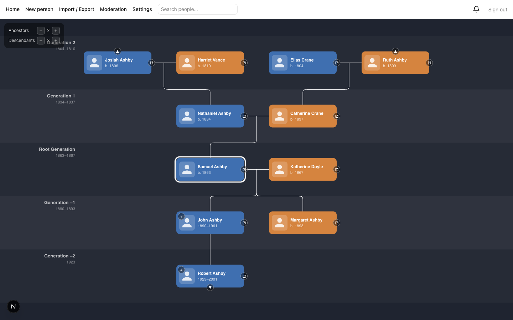
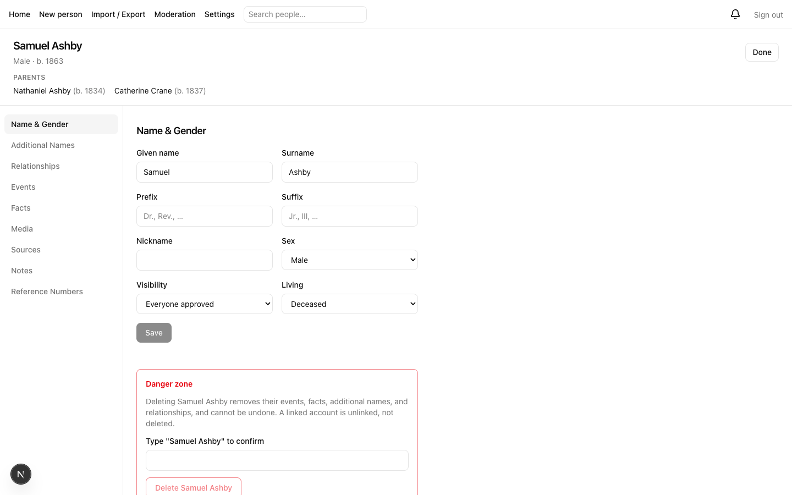

# Rootward

A self-hostable, open-source family-tree website. Import a GEDCOM, browse your
family in an animated generational view, edit people in a detailed editor, and
export a GEDCOM back out. Built for a family to run its own tree — one
deployment, one tree.

> Status: **MVP built, pre-release.** See [`docs/WAYFINDER.md`](docs/WAYFINDER.md)
> for the design decisions and [`docs/SPEC.md`](docs/SPEC.md) for the build spec.

## Screenshots

|                                              Tree view                                              |                                           Edit view                                           |
| :-------------------------------------------------------------------------------------------------: | :-------------------------------------------------------------------------------------------: |
|  |  |

## What it does

- **GEDCOM in and out.** The database is the source of truth. Import seeds the
  tree; export produces a faithful GEDCOM you can open in any genealogy app.
- **A tree view centered on a person.** Ancestors above, descendants below,
  generation bands labeled relative to whoever you are looking at. Click anyone
  to re-center.
- **A detailed person editor.** Names, events, facts, media, sources, and
  citations — modeled on MacFamilyTree's editor.
- **Family accounts.** Members sign in with a magic link or Google and are
  matched to their place in the tree. Approved members see the whole family
  history; living people show only basics; anyone can ask to be hidden.
- **Moderation and roles.** Viewers read, moderators edit, one admin configures.
- **Live collaborative editing.** See who else is editing a profile; a
  version check stops two editors from overwriting each other.

## Tech

Next.js + TypeScript on Vercel. Supabase for Postgres, Auth, Storage, Realtime,
and Edge Functions. `family-chart` for the tree view. No separate backend
service — a self-hoster runs Supabase and deploys the web app.

## Local development

Prerequisites: Node 22.9+, `pnpm` 11+, the [Supabase CLI](https://supabase.com/docs/guides/local-development),
and Docker (or OrbStack) running.

```sh
pnpm install
cp .env.example .env        # then fill in the local keys — see below
pnpm dev                    # starts the Supabase stack, then the web app
```

`pnpm dev` brings up the local Supabase stack (`supabase start`) and the Next.js
app together. Open http://127.0.0.1:3000.

| Command           | What it does                                                                                                                                                                                        |
| ----------------- | --------------------------------------------------------------------------------------------------------------------------------------------------------------------------------------------------- |
| `pnpm dev`        | Supabase stack + web app (http://127.0.0.1:3000). Ctrl-C stops only the web app.                                                                                                                    |
| `pnpm dev:fresh`  | Everything, rebuilt to what is in git: `pnpm install`, restart the stack, `db reset` (migrations + seed — **wipes local data**), regenerate types, then edge functions + web app. Ctrl-C stops all. |
| `pnpm dev:up`     | Same as `dev:fresh`, but keeps local data (`migration up` instead of `db reset`).                                                                                                                   |
| `pnpm dev:status` | Up/down summary of both, with the local URLs                                                                                                                                                        |
| `pnpm dev:stop`   | Stops the Supabase stack (`supabase stop`)                                                                                                                                                          |
| `pnpm dev:reset`  | Drops and re-migrates the local database + seed                                                                                                                                                     |

`dev:fresh` and `dev:up` serve the edge functions with
`supabase functions serve --import-map supabase/functions/deno.json`, the form
that binds the `packages/*` directories (see `supabase/functions/README.md`).
Both restart the Supabase stack, so run them only when nothing else on the
machine is using it.

**Demo data.** `supabase db reset` (and the first `supabase start`) load
`supabase/seed.sql` — a demo family tree and an admin account,
`admin@rootward.test`. `/login` only offers magic link and Google (the
product has no password sign-in — decision 11), so sign in with that email
there and open the link from Mailpit at http://127.0.0.1:57324.

The account also has a local-dev-only password, `rootward-admin`, for
scripts and API calls — there is no password field in the app to type it
into. Get a session with it directly against GoTrue:

```sh
curl -X POST "http://127.0.0.1:57321/auth/v1/token?grant_type=password" \
  -H "apikey: $NEXT_PUBLIC_SUPABASE_ANON_KEY" \
  -H "Content-Type: application/json" \
  -d '{"email":"admin@rootward.test","password":"rootward-admin"}'
```

After the stack is up, `supabase status -o env` prints the local keys as
`ANON_KEY` / `SERVICE_ROLE_KEY` — copy those two values into
`NEXT_PUBLIC_SUPABASE_ANON_KEY` / `SUPABASE_SERVICE_ROLE_KEY` in `.env`.

**Ports.** Rootward's Supabase stack uses the default Supabase ports shifted by
`+3000` (`57321` API, `57322` database, `57323` Studio, `57324` Mailpit) so it
does not collide with another project's local stack. The web app runs on `3000`.
The full set is in [`supabase/config.toml`](supabase/config.toml).

## Self-hosting

Two deploy paths, both in [`docs/deploy/`](docs/deploy):

- [Vercel + Supabase Cloud](docs/deploy/vercel-supabase-cloud.md) — the
  fastest start, no server to maintain.
- [Docker Compose self-host](docs/deploy/docker-compose-self-host.md) — run
  it on your own server.

## Contributing

See [`CONTRIBUTING.md`](CONTRIBUTING.md) for the branch, verify, and PR flow.

## Credits

Three of the themes use palettes published under the MIT license:

- **Flexoki** by Steph Ango — <https://stephango.com/flexoki>
- **Rosé Pine** (Dawn / Moon) — <https://rosepinetheme.com>
- **Gruvbox** by Pavel Pertsev — <https://github.com/morhetz/gruvbox>

## License

[MIT](LICENSE).
