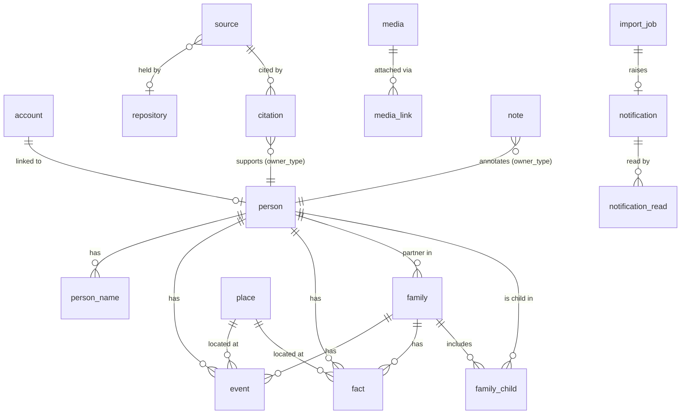

# Rootward — Build Spec (MVP)

Derived from `docs/WAYFINDER.md`. Every section cites the decision(s) it
implements. If this spec and WAYFINDER disagree, WAYFINDER wins — fix the spec.

This document is the build contract. It is detailed enough that each GitHub issue
is a mechanical slice of it. It is agent-facing: verbosity over brevity.

---

## 1. Product summary

A self-hostable, open-source family-tree website. The database is the source of
truth; GEDCOM is import/export only (decision 1). Approved family members browse
the whole tree; moderators edit; one admin per deployment configures it
(decisions 6, 18). Single-tenant — one deployment, one tree (decision 17).
The product sentence (decision 36): **a family maintains and grows its tree on
a website it hosts itself.** A GEDCOM is one way to start a tree, not the only
way — moderators create people and relationships in-app, and admins delete
and wipe. Every entity the site holds is created, linked, and deleted from the
UI; the WAYFINDER **Journeys** section is the checklist this spec is built from,
alongside the decisions.

Two primary screens:
- **Tree view** — an animated hourglass chart (`family-chart`) centered on one
  person, ancestors up, descendants down, click to re-center (decisions 23, 28).
- **Edit view** — a full-screen MacFamilyTree-style multi-panel form for one
  person (decisions 10, 21).

---

## 2. Tech stack

| Concern | Choice | Decision |
| --- | --- | --- |
| Frontend framework | Next.js (App Router) + TypeScript | 34 |
| UI / styling | Tailwind CSS + shadcn/ui (Radix primitives copied into `apps/web/components/ui`) | 34 |
| Hosting (frontend) | Vercel free tier | 32 |
| Backend | Supabase — Postgres, Auth, Storage, Realtime, Edge Functions | 8 |
| Server compute | Supabase Edge Functions (Deno) | 8 |
| Tree layout/render | `family-chart` (d3-based) | 23 |
| Auth methods | Magic link + Google OAuth, no passwords | 11 |
| Local dev | Docker Compose (Supabase local) + `pnpm dev` | 32 |
| Package manager | pnpm workspaces (monorepo) | — |
| CI | GitHub Actions | 32 |
| Fuzzy name match | Postgres `pg_trgm` extension | 24 |
| Scheduled jobs (post-MVP) | `pg_cron` | 29 |
| Geocoding (post-MVP) | Nominatim (OSM) | 30 |
| Map (post-MVP) | MapLibre GL JS + OSM tiles | 30 |

### Rules that carry into implementation

- The GEDCOM parser/serializer is a **portable module** (`packages/gedcom`), pure
  TypeScript, no Deno- or Node-specific APIs, so a C#/iDesign service could take
  it over later (decision 8). It is consumed by the Edge Functions and by tests.
- The importer is **chunked and resumable** — never one big transaction
  (decision 8).
- Access control is enforced by **Postgres row-level security (RLS)**, not
  frontend code (decision 6).
- Every editable row carries `updated_at`, used as an optimistic-concurrency
  token (decision 26).

---

## 3. Repository structure

```
/
├── apps/
│   └── web/                    # Next.js app (the only frontend)
│       ├── app/                # App Router routes
│       ├── components/
│       │   └── ui/             # shadcn/ui components (owned, not a dependency)
│       ├── lib/
│       │   ├── db/             # generated Supabase types + typed queries
│       │   └── supabase/       # client/server Supabase helpers
│       └── ...
├── packages/
│   ├── gedcom/                 # portable GEDCOM parser + serializer (pure TS)
│   └── shared/                 # shared types + genealogy-date parse/format
├── supabase/
│   ├── migrations/             # SQL migrations (the schema source of truth)
│   ├── tests/                  # pgTAP tests (RLS allow/deny, schema guards)
│   ├── functions/
│   │   ├── gedcom-import/
│   │   ├── gedcom-export/
│   │   ├── media-process/
│   │   └── onboarding-match/
│   ├── config.toml
│   └── seed.sql
├── docs/
│   ├── WAYFINDER.md            # decision map (canonical)
│   ├── SPEC.md                 # this file
│   └── reference/              # MacFamilyTree screenshots, original notes
├── .github/workflows/ci.yml
├── PROGRESS.md                 # resume pointer for a fresh agent
├── CLAUDE.md                   # how to work in this repo
├── README.md
├── LICENSE                     # MIT
└── package.json                # pnpm workspace root
```

---

## 4. Data model

Postgres. All tables live in `public` unless noted. UUID primary keys
(`gen_random_uuid()`), `created_at timestamptz not null default now()`,
`updated_at timestamptz not null default now()` on every editable table. A
trigger bumps `updated_at` on every `UPDATE` — this is the concurrency token
(decision 26).

`updated_at` is present and trigger-maintained on **all** of `person`,
`person_name`, `family`, `family_child`, `event`, `fact`, `place`, `source`,
`repository`, `citation`, `media`, `media_link`, `note`, `account`,
`tree_settings` — every row the edit view can send back. The per-table lists
below do not repeat it.

`raw_gedcom jsonb` on every record that maps to a GEDCOM structure — holds any
sub-tag the model does not represent explicitly, re-emitted on export
(decision 4).

### 4.1 Genealogy date (embedded column set) — decision 22

Not a table. This column set is embedded wherever a genealogy date appears
(`event`, `fact`, `citation`, `media`). Prefix the columns with the context when
more than one date exists on a row.

| Column | Type | Notes |
| --- | --- | --- |
| `date_value_raw` | text | Exact GEDCOM `DATE` payload. Always round-trips. |
| `date_kind` | enum `genealogy_date_kind` | `exact · about · estimated · calculated · before · after · between · from_to · interpreted · phrase · unknown` |
| `date_year1 / date_month1 / date_day1` | smallint | First date. Month, day nullable. |
| `date_year2 / date_month2 / date_day2` | smallint | Second date for `between` / `from_to`. Nullable. |
| `date_calendar` | enum `calendar` | `gregorian · julian · hebrew · french_republican · unknown`. Default `gregorian`. |
| `date_dual_year` | boolean | `1700/01` style dual dating. Display as written. |
| `date_phrase` | text | Free text for `phrase` / `interpreted`, or an unparsed value. |
| `date_sort_key` | date (generated, stored) | Null when `year1` null. Otherwise `make_date` of `year1`/`month1`/`day1` with year and month clamped into range and missing month/day → 1, then `day1 - 1` added as days so an out-of-range day rolls forward rather than raising (a raise blocks the insert). One shared immutable function backs every embedding table. Timeline ordering, "age at event". |

Parsing/formatting lives in `packages/shared` (`parseGenealogyDate`,
`formatGenealogyDate`). Julian and Gregorian are fully parsed; Hebrew and French
Republican are stored raw with `date_phrase` set, no conversion.

### 4.2 Core genealogy tables

**`person`** — decisions 2, 4, 6, 21

| Column | Type | Notes |
| --- | --- | --- |
| `id` | uuid PK | |
| `gedcom_xref` | text | Original GEDCOM `@I…@`. Null for site-created people until first export assigns one. Unique when not null. |
| `given_name` | text | Primary `NAME` given part. |
| `surname` | text | Primary `NAME` surname. |
| `name_prefix` | text | e.g. "Dr.", "Rev." |
| `name_suffix` | text | e.g. "Jr.", "III" |
| `nickname` | text | Primary-name nickname (`NAME`/`NICK`). |
| `sex` | enum `sex` | `male · female · unknown · other` (GEDCOM `M/F/U/X`). |
| `is_living` | boolean | Explicit override. When null, computed: no death event AND (no birth year OR birth year within `tree_settings.living_threshold_years`). |
| `visibility` | enum `person_visibility` | `everyone_approved · close_family · moderators_only · hidden`. Default `everyone_approved`. MVP UI exposes only `everyone_approved` and `hidden` (decisions 7, 31). |
| `familysearch_id` | text | Reference Numbers panel. |
| `ancestral_file_number` | text | Reference Numbers panel. |
| `user_reference_number` | text | GEDCOM `REFN`. |
| `raw_gedcom` | jsonb | |
| `created_by / updated_by` | uuid → account | |

**`person_name`** — additional names only (primary is on `person`). Decision 21.

| Column | Type | Notes |
| --- | --- | --- |
| `id` | uuid PK | |
| `person_id` | uuid → person, on delete cascade | |
| `type` | enum `name_type` | `birth · married · maiden · also_known_as · nickname · religious · immigrant · other` |
| `given_name / surname / prefix / suffix / nickname` | text | |
| `sort_order` | smallint | |
| `raw_gedcom` | jsonb | |

**`family`** — decisions 2, 4

| Column | Type | Notes |
| --- | --- | --- |
| `id` | uuid PK | |
| `gedcom_xref` | text | Original `@F…@`. Unique when not null. |
| `partner1_id / partner2_id` | uuid → person, nullable, on delete set null | Positional. Either may be null (single-parent family). |
| `partner1_role / partner2_role` | enum `partner_role` | `husband · wife · partner · unknown`. Round-trips GEDCOM `HUSB`/`WIFE`; not used to gate anything (decision 2). |
| `relationship_type` | enum `union_type` | `married · partnership · civil_union · unknown` |
| `raw_gedcom` | jsonb | |

**`family_child`** — decision 2

| Column | Type | Notes |
| --- | --- | --- |
| `id` | uuid PK | |
| `family_id` | uuid → family, on delete cascade | |
| `person_id` | uuid → person, on delete cascade | |
| `relation_to_partner1 / relation_to_partner2` | enum `child_relation` | `biological · adopted · step · foster · guardian · sealed · unknown` (GEDCOM `PEDI` / `_FREL` / `_MREL`) |
| `sort_order` | smallint | Birth order. |
| `raw_gedcom` | jsonb | |
| unique | `(family_id, person_id)` | |

**`event`** — decisions 3, 22

| Column | Type | Notes |
| --- | --- | --- |
| `id` | uuid PK | |
| `owner_type` | enum `event_owner` | `person · family` |
| `person_id` | uuid → person, on delete cascade | Set iff `owner_type = person`. |
| `family_id` | uuid → family, on delete cascade | Set iff `owner_type = family`. CHECK enforces exactly one. |
| `type` | enum `event_type` | `birth · death · marriage · divorce · burial · cremation · christening · baptism · bar_mitzvah · bat_mitzvah · confirmation · first_communion · adoption · graduation · immigration · emigration · naturalization · census · residence · occupation · retirement · will · probate · engagement · marriage_banns · annulment · other` |
| `type_other` | text | Label when `type = other` (GEDCOM `EVEN`/`TYPE`). |
| `date_*` | (embedded date set 4.1) | |
| `place_id` | uuid → place, nullable, on delete set null | |
| `value` | text | Description / value (occupation title, cause of death, …). |
| `age_text` | text | GEDCOM `AGE`. |
| `sort_key` | timestamptz | **Plain column, trigger-populated** (not `generated` — Postgres forbids a generated column that reads another generated column, and this needs a per-type tie-break a scalar expression cannot express). A `BEFORE INSERT OR UPDATE` trigger sets it from `date_sort_key` plus a per-`type` ordinal (birth before christening before death …). |
| `raw_gedcom` | jsonb | |
| `created_by / updated_by` | uuid → account | |

**`fact`** — attributes. Decisions 3, 6, 21

| Column | Type | Notes |
| --- | --- | --- |
| `id` | uuid PK | |
| `owner_type` | enum `fact_owner` | `person · family` (mostly person). |
| `person_id / family_id` | uuid, nullable | CHECK exactly one. |
| `type` | enum `fact_type` | `eye_color · hair_color · height · weight · physical_description · ethnic_origin · skin_color · religion · nationality · occupation · education · caste · title_of_nobility · number_of_children · number_of_marriages · property · national_id · ssn · medical · other` |
| `type_other` | text | |
| `value` | text | |
| `date_*` | (embedded date set) | |
| `place_id` | uuid → place, nullable | |
| `visibility` | enum `fact_visibility` | `everyone_approved · close_family · moderators_only · hidden`. Default `everyone_approved`. |
| `is_sensitive` | boolean generated | `type in ('ssn','national_id','medical')` — always hidden from non-moderators regardless of `visibility` (decision 6). |
| `raw_gedcom` | jsonb | |
| `created_by / updated_by` | uuid | |

**`place`** — decisions 5, 30

| Column | Type | Notes |
| --- | --- | --- |
| `id` | uuid PK | |
| `name` | text not null | Full place string as entered. |
| `normalized_name` | text | Lowercased, trimmed, punctuation-collapsed. Used for dedupe and lookup. Unique when not null (rows exist before normalization). |
| `locality / county / state / country` | text | Optional parsed parts. |
| `latitude / longitude` | numeric(9,6) | Post-MVP (decision 30). |
| `geocode_source` | enum `geocode_source` | `nominatim · manual · none`. Post-MVP. |
| `geocoded_at` | timestamptz | Post-MVP. |
| `raw_gedcom` | jsonb | |

### 4.3 Sources — full GEDCOM model (decision 21)

**`repository`** — `id`, `gedcom_xref` (unique when not null), `name`, `address`,
`phone`, `email`, `website`, `raw_gedcom`.

**`source`** — `id`, `gedcom_xref` (unique when not null), `title`, `author`,
`publication_info`, `repository_id` (→ repository, nullable), `source_text`
(transcription), `raw_gedcom`.

**`citation`** — links a source to a record.

| Column | Type | Notes |
| --- | --- | --- |
| `id` | uuid PK | |
| `source_id` | uuid → source, on delete cascade | |
| `owner_type` | enum `citation_owner` | `person · event · fact · family · person_name` |
| `owner_id` | uuid | |
| `page` | text | GEDCOM `PAGE`. |
| `data_text` | text | Quoted data (`DATA`/`TEXT`). |
| `date_*` | (embedded date set) | Date as stated by this source. |
| `quality` | smallint | GEDCOM `QUAY` 0–3. Nullable. |
| `raw_gedcom` | jsonb | |

### 4.4 Media (decision 25)

**`media`**

| Column | Type | Notes |
| --- | --- | --- |
| `id` | uuid PK | |
| `gedcom_xref` | text | `@O…@`, unique when not null. |
| `original_filename` | text | Preserved for export. |
| `mime_type` | text | |
| `size_bytes` | bigint | |
| `storage_path_original` | text | Path in the private bucket. |
| `storage_path_thumb` | text | ~240px WebP. Repointed at a fresh versioned path (`<id>/thumb-<token>.webp`) after a rotate/crop. |
| `storage_path_display` | text | ~1200px WebP. Same versioning as the thumb. |
| `rotation` | smallint | `0 · 90 · 180 · 270`, clockwise, default `0`. A non-destructive edit on top of the original *after its EXIF `Orientation` is applied* (issue #108 — the decoder returns the raw sensor raster, the pipeline turns it upright first). The original is never rewritten, the derivatives are regenerated with it applied. |
| `crop_x / crop_y / crop_width / crop_height` | integer | Optional crop rectangle in the *rotated* upright original's pixel space, all four set or all null (CHECK). Applied after `rotation` when the derivatives are regenerated. |
| `title` | text | |
| `date_*` | (embedded date set) | "Date taken". |
| `exif` | jsonb | GPS stripped when `tree_settings.strip_exif_gps` (default true). |
| `raw_gedcom` | jsonb | |
| `uploaded_by` | uuid → account | |

**`media_link`**

| Column | Type | Notes |
| --- | --- | --- |
| `id` | uuid PK | |
| `media_id` | uuid → media, on delete cascade | |
| `owner_type` | enum `media_owner` | `person · event · fact · family · source · place` |
| `owner_id` | uuid | |
| `is_primary` | boolean | Person's main photo. Partial unique index: one primary per `(owner_type, owner_id)`. |
| `sort_order` | smallint | |
| `caption` | text | Link-specific caption. |

### 4.5 Notes (decision 21)

**`note`** — polymorphic.

| Column | Type | Notes |
| --- | --- | --- |
| `id` | uuid PK | |
| `gedcom_xref` | text | For shared `NOTE` records; null for inline notes. |
| `owner_type` | enum `note_owner` | `person · event · fact · family · family_child · source · citation · media` |
| `owner_id` | uuid | |
| `text` | text not null | |
| `sort_order` | smallint | |
| `raw_gedcom` | jsonb | |

### 4.6 Accounts, roles, settings

**`account`** — one row per `auth.users` row. Decisions 12, 14, 18.

| Column | Type | Notes |
| --- | --- | --- |
| `id` | uuid PK, = `auth.users.id`, on delete cascade | |
| `role` | enum `account_role` | `viewer · moderator · admin`. Default `viewer`. |
| `person_id` | uuid → person, nullable, unique | The linked node (decision 14: at most one). |
| `status` | enum `account_status` | `active · pending · suspended`. `pending` = signed in but not yet approved/linked. |
| `display_name` | text | From auth profile; shown in Presence and audit. |
| `theme` | text, CHECK = the registry's `THEME_IDS` | Default `flexoki`. Per-member (decision 38, #80); `appearance-parity.test.ts` holds the CHECK to `THEME_IDS`. |
| `color_mode` | text, CHECK `system · light · dark` | Default `system`. Per-member (#80). |
| `created_at / updated_at` | timestamptz | |

**`tree_settings`** — singleton (CHECK `id = 1`). Decision 20.

| Column | Type | Default | Notes |
| --- | --- | --- | --- |
| `id` | smallint PK | `1` | Singleton guard. |
| `tree_name` | text | | |
| `tree_description` | text | | |
| `allow_self_signup` | boolean | `true` | Decision 12. |
| `living_threshold_years` | smallint | `100` | Decision 6. |
| `default_root_person_id` | uuid → person | | Start person (decision 21). |
| `default_generations_up` | smallint | `2` | Decisions 9, 28. |
| `default_generations_down` | smallint | `2` | |
| `media_max_bytes` | bigint | `10485760` | Decision 25. |
| `media_allowed_mime` | text[] | `{image/jpeg,image/png,image/webp,image/gif,image/heic,application/pdf}` | Decision 25. |
| `strip_exif_gps` | boolean | `true` | Decision 25. |
| `backup_enabled` | boolean | `false` | Post-MVP (decision 29). |
| `backup_frequency` | enum `backup_frequency` | `daily` | Post-MVP. |
| `backup_retention` | smallint | `14` | Post-MVP. Lower than a GEDCOM-only job because archives include media. |
| `updated_by` | uuid | | |

**`audit_log`** — decision 21. Written only by a `SECURITY DEFINER` trigger on
the genealogy + account tables.

| Column | Type | Notes |
| --- | --- | --- |
| `id` | bigint identity PK | |
| `table_name` | text | |
| `row_id` | uuid | |
| `action` | enum `audit_action` | `insert · update · delete` |
| `actor_id` | uuid → account, nullable | From `auth.uid()`. |
| `changed_at` | timestamptz default now() | |
| `old_data / new_data` | jsonb | |

### 4.7 Onboarding and moderation

**`invitation`** — decision 12

| Column | Type | Notes |
| --- | --- | --- |
| `id` | uuid PK | |
| `email` | text not null | |
| `person_id` | uuid → person, on delete cascade | Node to link on accept. |
| `role` | enum `account_role` | Default `viewer`. Only an admin may set `moderator`/`admin`. |
| `invited_by` | uuid → account | |
| `status` | enum `invitation_status` | `pending · accepted · expired` |
| `accepted_by` | uuid → account, nullable | |
| `accepted_at` | timestamptz | |

**`access_request`** — decision 13

| Column | Type | Notes |
| --- | --- | --- |
| `id` | uuid PK | |
| `account_id` | uuid → account | |
| `submitted_name` | text | |
| `submitted_birth_month / submitted_birth_year` | smallint | |
| `message` | text | |
| `status` | enum `request_status` | `pending · approved · rejected` |
| `resolved_by` | uuid, nullable | |
| `resolved_at` | timestamptz | |

**`claim_attempt`** — decision 24 rate limiting

| Column | Type | Notes |
| --- | --- | --- |
| `id` | uuid PK | |
| `account_id` | uuid → account | |
| `attempted_at` | timestamptz default now() | |
| `succeeded` | boolean | |

Cap: 5 attempts / account / rolling 24h. Enforced in `onboarding-match`.

**`notification`** — decisions 16, 27. Audience is always moderators + admins.

| Column | Type | Notes |
| --- | --- | --- |
| `id` | uuid PK | |
| `type` | enum `notification_type` | `self_claim_linked · access_requested · claim_attempt_cap · import_finished · import_failed · hide_request` |
| `payload` | jsonb | Type-specific: `person_id`, `account_id`, `import_job_id`, free-text `message`. |
| `created_at` | timestamptz default now() | |
| `resolved_at` | timestamptz, nullable | |
| `resolved_by` | uuid → account, nullable | |

**`notification_read`** — decision 27 per-user read state

`notification_id` + `account_id` (PK), `read_at timestamptz default now()`.

### 4.8 Jobs

**`import_job`** — decision 8

| Column | Type | Notes |
| --- | --- | --- |
| `id` | uuid PK | |
| `filename` | text | |
| `storage_path` | text | Uploaded GEDCOM in a private bucket. |
| `mode` | enum `import_mode` | `initial · replace_all · match_update` (decision 33). |
| `status` | enum `import_status` | `uploaded · parsing · importing · completed · failed · cancelled` |
| `total_records / processed_records` | int | Progress. |
| `cursor` | jsonb | Resume point — which record/line to continue from (decision 8). |
| `stats` | jsonb | `{added, updated, skipped, removed}`. |
| `error_text` | text | |
| `started_by` | uuid → account | |
| `completed_at` | timestamptz | |

**`export_job`** — decision 29 (table exists in MVP; scheduled path is post-MVP)

`id`, `type` enum `export_type` (`manual_gedcom · manual_full · scheduled_full`),
`status`, `storage_path`, `size_bytes`, `error_text`, `started_by` (nullable for
scheduled), `created_at`, `completed_at`.

### 4.9 ER overview



(Polymorphic links — `citation.owner_*`, `media_link.owner_*`, `note.owner_*` —
are shown against `person` only for readability; each also targets `event`,
`fact`, `family`, etc. `import_job` → `notification` is not an FK either — the
link is `notification.payload->>'import_job_id'`.)

---

## 5. Access control (RLS) — decision 6

RLS enabled on **every** table. Helper functions (all `stable`,
`security definer`, `search_path = ''`):

- `auth_account()` → the caller's `account` row (or null).
- `is_approved()` → account exists and `status = 'active'`.
- `is_moderator()` → `status = 'active'` **and** role in (`moderator`, `admin`).
  The active check is deliberate: a suspended moderator keeps no privileges.
- `is_admin()` → `status = 'active'` and role = `admin`.
- `person_is_living(person_id)` → boolean. No death event AND (no birth year OR
  birth year within `tree_settings.living_threshold_years`), unless
  `person.is_living` is set explicitly. Load-bearing — the whole access model and
  every §5 policy test depends on it.
- `person_is_visible(person_id)` → boolean, per the ladder below.
- `family_is_visible(family_id)` → at least one partner visible, or a visible
  child.
- `close_family_of(viewer_person_id)` → set of person ids (post-MVP; parents,
  children, siblings, grandparents, grandchildren, spouses).

### Visibility ladder for `person`

A person row is visible when the caller `is_approved()` **and** one of:
- `visibility = 'everyone_approved'`, or
- `is_moderator()`, or
- `visibility = 'close_family'` and viewer's linked person is in
  `close_family_of` that person (post-MVP), or
- viewer's linked person **is** that person.

Unauthenticated visitors: **no access to anything but `/login`** (decision 35).
There is no public tree in the MVP. A public read-only view is a possible
post-MVP feature.

### Dependent tables

- `person_name`, `family_child` — visible when the owning person is visible.
- `event`, `fact` — `owner_type` is `person` **or** `family` (§4.2, §4.3). Rule:
  visible when `owner_type = 'person'` and that person is visible, **or**
  `owner_type = 'family'` and `family_is_visible(family_id)`. A family-owned
  marriage or divorce event must not fall through to a deny (its `person_id` is
  null) or to a permissive leak.
- `citation`, `note`, `media_link` — polymorphic `owner_type`. Visible when the
  target is visible, chained through `owner_type`: a `person` target uses
  `person_is_visible`, a `family` target uses `family_is_visible`, an
  `event` / `fact` target inherits that row's own visibility (helper functions
  `event_is_visible` / `fact_is_visible`); a `note` on a `citation` uses
  `citation_is_visible`; a `note` on a `family_child` uses `person_is_visible` of
  the child; a `source` / `place` / `media` target is visible to any approved
  member.
- `family` — `family_is_visible(family_id)`.
- `source`, `repository`, `place` — visible to any approved member (they carry no
  personal data on their own).
- `media` — visible to any approved member. The image bytes are served through
  short-lived signed storage URLs (decision 25), so the metadata row itself needs
  no per-person gate.

### Field/row hiding for living people

- Living-person **basics** (name, sex, relationships, life events) stay visible
  to approved members — no masking (decision 6).
- A `fact` with `visibility <> 'everyone_approved'` is hidden from non-moderators
  — always, living or deceased.
- A `fact.is_sensitive` fact (`type in ('ssn','national_id','medical')`) is hidden
  from non-moderators **only while the subject is living**
  (`person_is_living(person_id)`). Decision 6: "Deceased people: fully visible."
  This is the load-bearing use of `person_is_living` — a family-owned sensitive
  fact (no `person_id`) stays hidden from non-moderators.

### Writes

- INSERT / UPDATE / DELETE on all genealogy tables: `is_moderator()`
  (`for all` policy). `citation` / `note` / `media_link` are genealogy tables
  here.
- DELETE on `person`, and `import_job` with `mode <> 'initial'`, and
  `tree_settings` UPDATE: `is_admin()` (decision 18).
- `notification`: no client INSERT. The `access_requested` / `hide_request` rows
  are raised by a `SECURITY DEFINER` path (a trigger on `access_request`, or the
  `onboarding-match` RPC), so the moderator-only surface stays intact.
  `is_moderator()` reads and resolves (UPDATE).
- `access_request`: the caller INSERTs a `pending` row for their **own**
  `account_id` and reads their own; `is_moderator()` reads and resolves all.
- `account`: caller reads own row; `is_moderator()` reads all; `is_admin()` is the
  only writer (UPDATE). The one exception is the member's own `theme` /
  `color_mode` (#80), written through the SECURITY DEFINER
  `set_appearance(theme, mode)` RPC — it touches exactly those two columns on
  `auth.uid()`'s row, so a viewer still cannot UPDATE their own row directly
  (`account_appearance_test.sql`). No client INSERT (the row is created by the post-sign-in
  trigger, #17) and no client DELETE (it goes away with its `auth.users` row).
  The `id` / `role` columns are further guarded in the invite and
  role-management flows, not by a column policy.
- `invitation`: `is_moderator()` manages; the WITH CHECK also requires
  `is_admin()` to grant a `role` other than `viewer`.
- `notification_read`: the caller's own rows only (all commands).
- `claim_attempt`: no client write — the `onboarding-match` edge function writes
  it under the service role.
- `audit_log`: `is_admin()` reads. No client writes (trigger only).

### Tests

`supabase/tests/rls_test.sql` (pgTAP) asserts both the allow and the deny path
for every helper and every policy; `supabase/tests/schema_guards_test.sql` checks
that RLS is on for every table and that the `set_updated_at` / `write_audit_log`
trigger sets have not drifted, and that no `public` function body carries a
DELETE or UPDATE without a WHERE clause. `supabase test db` runs every file in
`supabase/tests` in the CI `migrations` job. This is the guard that stops a
policy regression from shipping.

pgTAP connects as `postgres`, not as the `authenticator` role PostgREST uses,
so a bug that only shows under that role's session config is invisible to
the suite — `safeupdate`, preloaded on `authenticator`, is the known case
(#99, #100). `supabase/tests/safeupdate_authenticator_test.sql` opens a real
`authenticator` connection through `dblink` and runs the unfiltered-write
functions through it; its first assertions prove the guard is active on that
session, so the test cannot pass vacuously. A new admin action that writes a
whole table needs `where true` on each statement and a case in that file.

Every file must pass on a shared local stack that holds any tree (#109): an
exact count (`is(…, n)`) is scoped to the file's own fixture ids or names; a
whole-table or whole-bucket count is fine only as a deny (`= 0`) or a lower
bound (`>=`); fixture objects get names no real upload produces.
`seed_smoke_test.sql` is the one seed-dependent file; it skips itself unless
the seed's own root person is present, and CI checks that row before the
suite so the skip can never go green there.

---

## 6. GEDCOM mapping (`packages/gedcom`)

Supports reading GEDCOM 5.5.1 and 7.0; writes 5.5.1 (widest MacFamilyTree
compatibility) with a 7.0 option.

| GEDCOM | Rootward |
| --- | --- |
| `INDI` | `person` (+ `person_name`, `event`, `fact`, `note`, `media_link`, `citation`) |
| `INDI.NAME` (first) | `person.given_name` / `surname` / `NPFX` / `NSFX` / `NICK` |
| `INDI.NAME` (subsequent) or `TYPE`-tagged | `person_name` |
| `INDI.SEX` | `person.sex` |
| `FAM` | `family` (+ `family_child`, family `event`s) |
| `FAM.HUSB / WIFE` | `family.partner1_id` / `partner2_id` + role |
| `FAM.CHIL` | `family_child` |
| `FAM.CHIL.PEDI`, `_FREL`, `_MREL` | `family_child.relation_to_partner*` |
| `BIRT/DEAT/MARR/DIV/BURI/...` | `event` (typed) |
| `EVEN` + `TYPE` | `event` with `type = other`, `type_other` |
| `DSCR/OCCU/RELI/NATI/SSN/...` | `fact` (typed) |
| `DATE` (any form) | embedded date set (§4.1) |
| `PLAC` | `place` (deduped on `normalized_name`) |
| `SOUR` (record) | `source`; `REPO` → `repository` |
| `SOUR` (pointer, inline) | `citation` |
| `OBJE` | `media` + `media_link` |
| `NOTE` | `note` |
| `REFN / _UID / RIN / _FSFTID` | `person.user_reference_number` / provenance / `familysearch_id` |
| `_ROOTWARD_VIS` on `INDI` / on an attribute | `person.visibility` / `fact.visibility` — Rootward's own tag (#126), written only for a non-default value, read back as the ladder value; absent means `everyone_approved`. Other tools ignore it. |
| any unmapped sub-tag | parent record's `raw_gedcom` |

**Provenance:** import writes an `import_job` row; every created record keeps its
`gedcom_xref`. Re-export uses the stored xref so a round trip is stable
(decision 4).

**Media on import:** GEDCOM references media by file path. A plain `.ged`
upload leaves that as a reference only — the file is added later through the
Media section. A GedZip (the GEDCOM plus its media in one zip, issue #101)
gets its files matched to the `FILE` path on each `OBJE` record — path match,
then basename fallback for an absolute local path — and run through the same
validate / EXIF-strip / thumbnail pipeline `media-process` uses; a miss or a
rejected file (size, MIME) stays reference-only and is reported in
`import_job.stats.warnings`.

---

## 7. Edge Functions

### `gedcom-import` — decisions 8, 33

- Trigger: called by the import UI after the file is uploaded to storage.
- Reads `import_job`, streams the GEDCOM, processes in batches of N records,
  writes `processed_records` and `cursor` after each batch so a timeout resumes
  cleanly on the next invocation (self-reinvoke or client re-poll).
- The picked file is read by magic bytes in the browser, not its filename: a
  plain `.ged`/text file, or a zip (GedZip, issue #101). A GedZip is unzipped
  client-side before upload — not by this function — so its media never has
  to fit in the function's own memory as one archive (issue #104); the
  browser uploads the GEDCOM text and each media file as separate objects
  under the job's storage prefix (`@rootward/gedcom`'s `media-storage-keys`
  module owns that key shape). A GedZip's media files are matched and
  attached during the `media` phase (§6); everything else about the run is
  unchanged.
- `mode`:
  - `initial` — empty tree, straight insert.
  - `replace_all` — admin only; refuses if any `account.person_id` is set or
    edits exist since last import; truncates and reloads. **Not a function
    mode in the MVP (#60):** the UI blocks `initial` on a non-empty tree, and
    an admin's **Wipe tree** (§8.1 `/settings` — a backup export first, then
    truncate the genealogy tables, unlink every account, remove media objects)
    followed by a plain `initial` import is the same thing.
  - `match_update` — matches by `gedcom_xref` / `_UID`; produces a diff into
    `stats`; applies only after admin approval (two-phase: `parsing` produces the
    diff, admin approves, `importing` applies). Post-MVP for the approval UI;
    engine can land earlier.
- On finish: `status = completed|failed`, emit `notification`
  (`import_finished` / `import_failed`). When the default root person is
  unset (`tree_settings.default_root_person_id` null), set it (#51) — the
  rule (first `INDI`, or most descendants) is documented in the engine's doc
  comment.

### `gedcom-export` — decisions 1, 29

- `manual_gedcom` — build a 5.5.1 file from the DB, write to a private bucket,
  return a signed URL.
- `manual_full` — GEDCOM + all media as a GedZip (`<jobId>.gdz`, #124):
  `gedcom.ged` at the root, then every media row's stored original as a flat
  entry named by its original basename (a repeated basename gets
  `-<id prefix>`), and the `.ged`'s `FILE` values are those entry names so a
  re-import resolves each one exactly. Built as a stream — one original in
  memory at a time, the storage upload streams too — so the edge worker's
  memory cap does not bound the archive; a media row with no stored file
  keeps its recorded `FILE` and is warned about. This is the wipe-tree
  backup's type (decision 33).
- `scheduled_full` — post-MVP, `pg_cron` target, writes to the backup bucket,
  prunes to `backup_retention`.

### `media-process` — decision 25

- Input: an uploaded original in the private bucket + owner ref.
- Validates MIME against `tree_settings.media_allowed_mime` and size against
  `media_max_bytes`.
- Generates `thumb` (~240px) and `display` (~1200px) WebP. Converts HEIC → WebP.
- Strips EXIF GPS when `strip_exif_gps`; keeps "date taken" → `media.date_*`.
- Writes the `media` row + `media_link`.
- A later rotate/crop (§8.3's `/media` editor) does not go through this
  function: the browser regenerates the thumb/display pair from the original
  with `media.rotation` / `media.crop_*` applied (the `@rootward/media`
  pipeline, client-side as in issue #104), uploads it under a fresh
  versioned path, and a server action repoints the row and removes the
  superseded objects. The original object is never modified.

### `onboarding-match` — decision 24

- Deno edge function, not a bare RPC: a thin `Deno.serve` shell (any signed-in
  caller — the account is still `pending`) over a portable engine. One SQL
  function, `onboarding_match_search` (`security definer`, `search_path = ''`),
  does the trigram query — the caller cannot yet read `person` under RLS. The
  engine reads challenge facts and writes `claim_attempt` / `account` /
  `notification` / `access_request` through a service-role gateway.
- `POST { action: "search", givenName, surname, birthYear, birthMonth? }` →
  `{ candidates: [{ personId, challenges }] }`. `pg_trgm` similarity over
  `person` + every `person_name` variant; birth year exact, month ±1; combined
  score ≥ `0.3` (`pg_trgm`'s default — the challenge is the real discriminator).
  `challenges` is the **answerable** subset of `spouse_first_name`,
  `parent_first_name`, `birth_place`, `birth_day`, priority order, capped at two
  (WAYFINDER 24 "one or two"). A candidate already linked to an account, or with
  no answerable fact, is dropped. `personId` is an opaque uuid; no name, date,
  or place is ever returned.
- `POST { action: "verify", personId, <identity>, answers }` →
  `{ status }` where `status` is:
  - `linked` — one posed challenge answered correctly (DECISIONS 2026-08-31).
    Sets `account.person_id` + `status = 'active'`; `claim_attempt(succeeded =
    true)`; `notification` (`self_claim_linked`).
  - `no_match` — `personId` not in the search set for the identity, or no posed
    challenge answered. `claim_attempt(succeeded = false)`. The `/onboarding` UI
    (#19) offers the request-access form from here.
  - `already_claimed` — the node was linked between the two calls (or lost the
    write race). `claim_attempt(succeeded = false)`.
  - `already_linked` — the account is already active / linked. No attempt row.
  - `rate_limited` — 6th verify within a rolling 24h. No attempt row (the
    refusal must not roll the window forward); instead one `access_request` +
    `notification` (`claim_attempt_cap`), deduped against an open request.
- The plain no-match `access_request` + `access_requested` notification (§9.3)
  is #19's request-access form plus an insert trigger on `access_request`, not
  this function — only the attempt-cap path here writes one automatically.

---

## 8. Frontend

### 8.1 Routes (`apps/web/app`)

| Route | Purpose | Access |
| --- | --- | --- |
| `/` | Redirect: `/tree/<root>` when approved, `/onboarding` when authed-not-approved, else `/login` | — |
| `/login` | Magic link + Google | public |
| `/onboarding` | Claim flow (name/birth → challenge) or request access | authed, not yet approved |
| `/tree` | Index: redirect to the default root; fallback to a deterministic person when no root is set; empty state ("Import a GEDCOM" / "Add the first person") when the tree is empty (#51) | approved |
| `/tree/[personId]` | `family-chart` hourglass view | approved |
| `/people` | Everyone, sorted by surname then given name, surname filter, paginated at the source (#62) | approved |
| `/person/[personId]` | Read-only profile. Moderators also see **Invite to claim** when the person has no linked account (#63). A linked viewer sees **Ask a moderator to hide this record** (#61) | approved |
| `/person/[personId]/edit` | Full-screen edit view. Admins also see **Delete person** (#59) | moderator+ |
| `/person/new` (or a header action) | Create a person: given name, surname, sex — all optional — then redirect to the edit view (#55) | moderator+ |
| `/moderation` | Notification queue, access requests, claims. `?invite=<personId>` preselects the invite form (#63) | moderator+ |
| `/import` | **Import / Export.** Upload GEDCOM, job status. Blocked with a clear message when the tree is not empty (#60). Export: start a `manual_gedcom` `export_job`, poll it, download through the signed URL; list past export jobs (#54) | moderator+ |
| `/settings` | Tabbed (#80, `?tab=`): **Appearance** (theme + mode, every approved member, the default tab) \| **Tree** (tree settings, root person picked by name (#53), **Wipe tree** with a backup export first (#60)) \| **Roles** (role management). The admin gate applies per tab, not per route: a non-admin sees only the Appearance tab and a direct hit on a gated tab renders the refusal in place. The canvas's fourth tab, Privacy, arrives with decision 31's per-person privacy UI (post-MVP) — nothing exists to put behind it yet | approved (Appearance) · admin (the rest) |

**Global chrome (#50):** the header renders on every authed route. It carries
**Home**, a person search box (#62), **My record** (when `account.person_id` is
set), role-gated links — **Import** and **Moderation** for `moderator+`,
**Settings** for `admin` — the notification bell (`moderator+`), and **Sign
out** (server action → `auth.signOut()` → `/login`). Links are convenience; the
pages enforce access server-side. Every route is usable at 390 px wide (#65).

**Themed chrome (Phase 10, decision 38 — #78, #79):** every mock on the
redesign canvas shares one chassis that the header and the tree grow into.
Header 64px on `var(--card)` with a bottom border. Left: the **wordmark** —
"Rootward" 26px/600 in `var(--font-display)`, with an optional mark chosen by
`data-mark` (`none`, a `circle` disc with an "R", a `sprig` stroke-SVG, or a
`subtitle` — the tree name as a small-caps label). Centre: the
`resolveHeaderNav` links, styled by `data-nav` (`underline`, `pill`, `caps`).
Right: the bell, then an **account chip** — an initials disc in
`var(--primary)` / `var(--primary-foreground)` (the canvas drew it in
`--rw-accent-2`; that pair fails AA as text on every light theme, #81) and
the first name, `rounded-pill`, bordered — whose menu
holds **My record** (when linked), **Appearance** (`/settings`, any
approved member, #80), and **Sign out** (the sign-out form moved
into the menu in #79; the item is a `menuitem`, and the e2e `signOut`
helper opens the chip first). The nav stays role-gated as above; below
`sm` the header wraps and the nav collapses into the **Menu** button. On the tree, the black depth-stepper overlay top-left is replaced by a
**Generations panel** bottom-right: 236px, card tokens, label "GENERATIONS
SHOWN", two steppers (26px, `var(--rw-radius-control)`), and a "Reset to
defaults" link shown only when off the defaults. Section cards, buttons, and
inputs use the shadcn `button` / `input` components pointed at
`var(--rw-radius-control)` (`<select>` / `<textarea>` share `inputClass`,
the `Input`'s twin); links are `var(--primary)`, hover adds an underline
(the #79 hover colour `--rw-accent-2` failed AA, #81 — the token stays in
the contract for non-text use, nothing reads it today). Which theme draws
all of this is a per-member choice
(§10 Phase 10): `account.theme` / `account.color_mode` win when a session
exists, the `rw-theme` / `rw-mode` cookies (mirrored on sign-in and on every
save, one year, `SameSite=Lax`) carry the last member's pick to the signed-out
`/login` page. `<html>` carries `data-mode`; the pre-paint script always
ships and owns `.dark` for every mode (the server never puts it in
`className`, so the route re-render a save's cookie write triggers cannot
strip it); the picker writes the same `<html>` attributes client-side
(`lib/theme/apply.ts`) so a pick shows before its save lands, and saves run
one at a time.

### 8.2 Tree view — decisions 23, 28

- `family-chart` v2 with **custom HTML cards**, drawn on the theme tokens
  (#78, decision 38): 212×84 on `--card` / `--border` / `--radius` /
  `--rw-shadow`; a 52px avatar (photo or silhouette) whose sex colour
  (`--rw-male|female|neutral`) is worn per the `data-avatar` chassis switch
  (`ring`, `fill`, `tab`, `print`); name 14px/600 in the body face
  (`data-name-font="display"` → 17px display face); a 7px sex dot then the
  birth–death years in muted lining numerals. The focus card has a 2px
  `--primary` border and a 15% halo. Expand / open-profile affordances are
  22px card-coloured circles with a stroke-SVG plus or arrow. Connectors are
  `--rw-link`, 1.5px. `[data-ground="dots"]` adds a dotted ground.
- **Generation bands:** two layers. Alternate rows are filled `--rw-band`
  inside the chart's zoom layer, so they pan and scale with the cards. The
  labels — relative name (`Root Generation`, `Generation 1` up,
  `Generation −1` down) + birth-year range of that band's people — sit
  outside the zoom layer, pinned 36px from the viewport's left edge and
  re-synced to each band's on-screen top on every pan, zoom, and re-layout;
  a band that runs past the top edge keeps its label pinned there.
- **Data:** `getNeighborhood(personId, up, down)` — one query returning the
  focus, ancestors to `up`, descendants to `down`, focus's siblings, focus's
  partners (decision 28). `up`/`down` from `tree_settings` defaults, overridable
  in-session.
- **Generations panel** (#78): bottom-right of the viewport, 236px on card
  tokens — "GENERATIONS SHOWN", an Ancestors and a Descendants stepper (26px
  buttons on `--rw-radius-control`), and a "Reset to defaults" link in
  `--primary` shown only when off the defaults. Replaces the black stepper
  overlay top-left.
- **Ended unions** (#122): a divorced or annulled couple's spouse link is
  drawn dashed and faded (`ended_by` on the family payload — §8.3).
- **Married names:** a person with a `married` or `maiden` / `birth` name
  variant reads `Given Married (Maiden)` — the married surname shown, the
  birth surname in parentheses; the primary surname stands in for whichever
  variant is not recorded, and the parenthetical is dropped when it would
  repeat the shown surname (`married_surname` / `maiden_surname` on the
  person payload — §8.4; `lib/tree/person-card.ts`). Keyed on the name rows,
  not on sex. Tree cards only — the profile, People list, and search show
  the primary name.
- **Click** a card → `router.push('/tree/<id>')`; `family-chart` animates the
  re-center. Focus person in the URL (decision 28) — back button works.
- **Open the profile** (decision 28, #52): an icon button on the card and a
  double-click on the card body both `router.push('/person/<id>')`. The icon
  uses the same delegation pattern as the expand buttons (`data-*` attribute,
  a real `<button>`, `stopPropagation` so it does not also re-center).
- **Expand affordance** on any card with relatives outside the current window →
  loads one more level for that branch without re-centering. The partner
  affordance is offered only on the focus person and their descendants:
  `family-chart` draws spouses only on that side of the root, so an
  ancestor's other marriage is reached by re-centering on that ancestor
  (#106).
- Extended family (aunts/uncles/cousins) — a later toggle, not in v1.

### 8.3 Edit view — decisions 10, 21, 26

Full-screen. Left rail: section nav. Top: parents (click to navigate). Bottom:
partners + children (click to navigate). "Done" returns to the profile.

Sections (v1): **Name & Gender · Additional Names · Relationships · Events ·
Facts · Media · Sources · Notes · Reference Numbers**. (v2: Labels, Bookmarks,
Influential Persons, DNA, Stories, ToDos, Numbering System — decision 21.)

- **Relationships** (decision 36, #56) — the ninth v1 section, added 2026-09-12.
  Actions: **add parent**, **add partner**, **add child**, **remove from
  family**. Each resolves to `family` / `family_child` rows per decision 2 — a
  family is a couple plus children, partner roles as the enum. Picking an
  existing person uses the shared `PersonPicker`; **create new** inserts a
  person (#55) and links it in one step. Exposes `family.relationship_type`,
  `family_child.relation_to_partner1/2`, and `family_child.sort_order`
  (reorder children; default by birth `date_sort_key`). `partner1_role` /
  `partner2_role` derive from sex, editable. A single known parent is a family
  with one partner null; a later "add parent" fills that slot, not a second
  family. Removing the last member deletes the family row and its family
  events. `family` rows carry `updated_at` and take the same version check as
  every other row. `get_neighborhood` needs no change — the tree reflects the
  new rows on return. Each union card also shows a **status line** built
  from the family's events — `Married — 12 Jun 1990, Springfield ·
  Divorced — 2003` — with a link to Events for editing the dates, and a
  **Record a divorce** button (#122) that writes one `divorce` family event
  with a `DateInput` date, in place. The button shows only while the union
  stands (see *Ended unions* below) and both partners are set.
- **Family events** (decision 21 as amended by 36, #57) — marriage, divorce,
  engagement, annulment appear in the Events section under a **Union with
  \<partner\>** group, one per `family` the person is a partner in. Writes go
  to `event` with `family_id` set and `person_id` null. Same `DateInput`,
  `PlaceInput`, citations, notes, and version check as person events.
- **Ended unions** (#122) — "divorced" is derived, never stored:
  `family_ended_by(family_id)` returns `divorce` or `annulment` (annulment
  wins when both exist) from the family's events, or null while the union
  stands. Event order is ignored — a remarriage to the same person is a
  second `family` row, not a later marriage event on the ended one.
  `relationship_type` is the kind of union, not its state, and is never
  changed by a divorce. The derivation is exposed twice from one
  function: as `ended_by` on every family in the `get_neighborhood` /
  `expand_relatives` payloads (the tree and the edit shell's relatives
  strip need no second fetch), and as the PostgREST computed field
  `ended_by` on `family` rows (the Relationships section). Surfaces: the
  profile's partner line reads `Married — 1990 · Divorced — 2003`, the edit
  shell's strip reads `Divorced`, the tree draws the couple's spouse link
  dashed and faded, and the union card's status line and button follow it.
  Widowed (a partner's death) is a separate derivation, not yet built.
- **Visibility and living** (decisions 6, 7, #58) — two controls in Name &
  Gender. Visibility offers `everyone_approved`, `moderators_only`, `hidden`
  in the MVP (`close_family` is post-MVP, #43 — hidden or shown disabled).
  Living is three-state: computed (`null`, with the computed value shown), yes,
  no.
- **Create** (#55): a new person needs only the form in §8.1 — placeholders
  (empty given name or surname, shown as "Unknown") and `sex = unknown` are
  normal in genealogy. `gedcom_xref` stays null; export assigns one (§4.2).
- **Delete** (decision 18, #59): admin only, behind a typed-name confirmation.
  `person_name`, `event`, `fact`, `note`, `citation`, `media_link`, and
  `family_child` rows follow their FK rules. A `family` where the person was a
  partner keeps its row with that partner null — the other partner's children
  are not touched. A linked `account` is unlinked (`person_id = null`), not
  deleted. The audit trigger records it.

- **`DateInput`** component (decision 22): one text field, live parse via
  `parseGenealogyDate`, interpretation shown below, shorthand hint (`abt`, `bet …
  and …`, `bef`, `aft`, `est`, `from … to …`). Unparsed → saved as `phrase`,
  flagged.
- **Save:** each section sends only changed rows with the `updated_at` each was
  loaded at. Server: `UPDATE … WHERE id = $1 AND updated_at = $2`. Zero rows →
  conflict for that row.
- **`ConflictDialog`** (decision 26): per rejected row, shows their value vs
  yours, "keep mine" (re-save) / "take theirs" (discard mine).
- **Presence** (decision 26): on mount, join Realtime channel `person:{id}`,
  track `{ user, section }`. A banner shows other editors and their section.

### 8.4 Data layer

- `apps/web/lib/db` — types from `supabase gen types typescript` (regenerated by
  `pnpm gen:types`, drift-checked in CI), plus typed query functions. No
  component talks to Supabase directly.
- `apps/web/lib/supabase` — three clients: browser, server (RSC / actions / route
  handlers), and service-role (`server-only`, bypasses RLS; for the
  onboarding-match RPC and GEDCOM jobs).
- View and edit share this layer, not components (decision 10).
- `getNeighborhood(client, focusId, up, down)` takes the caller's Supabase client
  (the re-center runs both server-side and client-side). It calls the
  `get_neighborhood(focus, up, down)` SQL function — one `jsonb` payload, one
  round trip, `SECURITY INVOKER` so RLS applies. `up` / `down` clamp to `0..10`.
  Returned `persons` are exactly the decision-28 set; a returned `family` row may
  still name a `partner*_id` outside that set (a descendant's spouse), which the
  expand-in-place path (§10 item 24) resolves on demand. Each family carries
  `ended_by` (§8.3 *Ended unions*, #122). Each person carries
  `married_surname` / `maiden_surname` — the surname of their first `married`
  (resp. `maiden`, else `birth`) `person_name` row, or null
  (`person_surname_variant`); `expand_relatives` carries the same.

### 8.5 Realtime

- **Presence:** `person:{id}` channel, edit view only.
- **Notifications:** `notifications` channel; moderators subscribe app-wide; the
  bell shows unread count from `notification` minus `notification_read`
  (decision 27). Resolve writes `resolved_*`; auto-resolve happens server-side
  when the triggering action completes.

---

## 9. Auth & onboarding flows

### 9.1 Sign-in (decision 11)

Supabase Auth, magic link + Google, no passwords. The browser client uses the
PKCE flow, so both methods return through one route handler, `/auth/callback`,
which exchanges the code for a session.

A Postgres trigger on `auth.users` insert (`on_auth_user_created`) creates the
matching `account` row (`role = viewer`, `status = pending`, `display_name` from
the auth profile).

The `ADMIN_EMAIL` bootstrap (decision 19) is done by the web tier, not the
trigger: a Postgres trigger cannot read the deployment environment, and Supabase
local config has no portable hook for a custom setting. `/auth/callback` calls
`maybeBootstrapAdmin` — when the signed-in email matches `ADMIN_EMAIL` it
promotes that account to `role = admin`, `status = active` with the service
role. Idempotent; a transient failure is re-attempted on the admin's next full
sign-in (they must sign out first — an established session does not re-enter
the callback).

Session gating is a Next.js proxy (`proxy.ts`, the Next 16 rename of
middleware): it refreshes the session on every request and redirects an
unauthenticated visitor to `/login` for every route except `/login` and
`/auth/*` (decision 35). `/` is a pure router — approved → `/tree/<root>`,
signed-in-not-approved → `/onboarding`, no session → `/login` (§8.1).

### 9.2 Invite path (decision 12)

Moderator opens a person → "Invite to claim" → enters email → row in
`invitation` + Supabase Auth invite sent. On acceptance, a handler links
`account.person_id = invitation.person_id`, `status = active`, `role =
invitation.role`.

### 9.3 Self-claim path (decisions 12, 13, 24)

`/onboarding` → name + birth month/year → `onboarding-match` (`search`) →
challenge question(s) → `onboarding-match` (`verify`) → on success, account
linked + active + moderator notification. No match, or the attempt cap, sends
the user to the request-access form → `access_request` + notification; user
sees "request sent" (the form and its notify trigger are #19; the cap writes an
`access_request` on its own — §7). Self-signup hidden entirely when
`allow_self_signup = false`.

### 9.4 Roles (decision 18)

`viewer` reads (per §5). `moderator` edits, invites, handles claims, runs
imports/exports, sees notifications. `admin` = moderator + role management +
settings + destructive actions.

---

## 10. Build phases → GitHub issues

Each item is one issue. Milestones = phases. Labels: `phase:N`, `area:db|gedcom|
frontend|auth|edge|infra`, `mvp`, `post-mvp`, `blocked`, `ready`.

### Phase 0 — Foundation
1. Scaffold pnpm monorepo: `apps/web` (Next.js + TS + Tailwind + shadcn/ui init +
   ESLint + Prettier), `packages/gedcom`, `packages/shared`, root scripts
   (`typecheck/lint/format/build/test`).
2. `supabase init`, `config.toml`, Docker Compose local dev, `pnpm dev` +
   `pnpm dev:status`, `.env.example`.
3. GitHub Actions CI: typecheck, lint, format check, test, migration check.

### Phase 1 — Data model
4. Migration: enums + `person`, `person_name`, `family`, `family_child`.
5. Migration: `event`, `fact`, `place` + embedded date columns + generated
   `date_sort_key` + trigger-populated `event.sort_key` (per §4.2).
6. Migration: `source`, `repository`, `citation`, `media`, `media_link`, `note`.
7. Migration: `account`, `tree_settings` (singleton), `audit_log` + `updated_at`
   trigger + audit trigger.
8. Migration: `invitation`, `access_request`, `claim_attempt`, `notification`,
   `notification_read`, `import_job`, `export_job`.
9. RLS: helper functions + policies for every table + allow/deny tests in CI.
10. `supabase gen types` wiring + `lib/db` typed query layer +
    `getNeighborhood`.

### Phase 2 — GEDCOM
11. `packages/shared`: `parseGenealogyDate` / `formatGenealogyDate` (Gregorian +
    Julian, dual dates) + tests.
12. `packages/gedcom`: reader (5.5.1 + 7.0) + fixtures + tests.
13. `packages/gedcom`: writer (5.5.1) + round-trip tests.
14. `gedcom-import` edge function — `initial` mode, chunked + resumable, job
    tracking, finish notification.
15. `gedcom-export` edge function — `manual_gedcom`.
16. `/import` UI — upload, job progress, result.

### Phase 3 — Auth & onboarding
17. Supabase Auth: magic link + Google, `/login`, session middleware, `account`
    creation trigger + `ADMIN_EMAIL` bootstrap.
18. `onboarding-match` edge function — `pg_trgm` search, challenge, rate limit,
    link + notify.
19. `/onboarding` UI — claim flow + request-access.
20. Invite flow — "Invite to claim" action + acceptance handler + `/moderation`
    stub.

### Phase 4 — Tree view
21. `family-chart` integration + custom `PersonCard` + gender tint + focus ring.
22. Generation bands overlay + relative labels + year ranges.
23. `getNeighborhood` wiring + re-center + `/tree/[personId]` deep links.
24. Expand-in-place for collapsed branches.
25. `/person/[personId]` read-only profile.

### Phase 5 — Edit view
26. Edit shell: full-screen layout, section nav, parents/partners/children strip,
    "Done".
27. Sections: Name & Gender, Additional Names, Reference Numbers.
28. `DateInput` component + Events section.
29. Facts section.
30. Sources section (source / citation / repository).
31. Notes section + row-level version check + `ConflictDialog`.
32. Presence indicators on the edit view.

### Phase 6 — Media
33. `media-process` edge function (validate, thumb/display, HEIC, EXIF).
34. Media upload + gallery + primary photo + `/media` viewer + Media section.
    - *Added 2026-09-14:* rotate/crop on the `/media` viewer (moderators) —
      non-destructive `media.rotation` + `media.crop_*`, derivatives
      regenerated in the browser (§4.4, §7 `media-process`).

### Phase 7 — Moderation & settings
35. Notification center + bell + Realtime + auto-resolve triggers.
36. Moderation queue: access requests, self-claims, reassign / unlink.
37. `/settings` — tree settings + role management.

### Phase 8 — Ship
38. Seed data + a demo GEDCOM + `supabase/seed.sql`. *(Built early — it blocks
    #18's `pg_trgm` tuning and #21's pedigree collapse.)* `supabase/seed.sql`
    seeds a demo admin + the "Ashby family" (multi-generation, a first-cousin
    marriage for pedigree collapse, living/deceased + hidden/moderators-only for
    RLS, name near-collisions for the #18 match). `docs/reference/demo-tree.ged`
    is a **separate** fictional family (the Marshes) for import/export testing —
    kept independent so a SQL tree and a GEDCOM tree of the same people can't
    drift. `supabase/tests/seed_smoke_test.sql` guards the seed; `rls_test.sql`
    truncates the data tables up front because `supabase test db` loads the seed.
39. Deploy docs: Vercel + Supabase Cloud, and Docker Compose self-host.
40. README, CONTRIBUTING, self-host guide, screenshots. *(Waits for Phase 9,
    so the screenshots show a usable app.)*

### Phase 9 — Gap closure (decision 36)

Added 2026-09-12. A gap audit found every item above built and the app still
not usable: no sign-out, no navigation, no create-person, no relationships, a
404 on a fresh deploy. The cause and the fix are WAYFINDER decision 36 and its
**Journeys** section. Issue numbers here are the GitHub issue numbers, not the
§10 sequence — the milestone is `Phase 9 — Gap closure`, label `phase:9`, all
`mvp`. Order is one session each, top to bottom; #64 goes first because it is
the build contract for #55–#57.

- **#64** Docs: this section, §8.1 / §8.3 / §7, WAYFINDER decision 36 +
  Journeys, `PROGRESS.md` pointer. *(Docs only.)*
- **#50** Header: sign-out, role-gated nav to Import / Moderation / Settings,
  **My record** (§8.1 global chrome).
- **#51** `/tree` index route: redirect to the root, deterministic fallback,
  empty state; `gedcom-import` sets the default root when unset (§7).
- **#52** Tree card: open the profile by icon and double-click (§8.2,
  decision 28).
- **#53** Settings: pick the default root person by name (`PersonPicker` moved
  to `components/`), not UUID.
- **#54** GEDCOM export UI: `/import` becomes Import / Export;
  `lib/db/export-jobs.ts`, invoke `gedcom-export`, poll, signed download,
  past-jobs list (§8.1).
- **#55** Create a person in-app: minimal form → edit view;
  `lib/db/person-create.ts`; placeholders allowed; RLS insert test (§8.3).
- **#56** Relationships section: add / remove parent, partner, child;
  `relationship_type`, `child_relation`, `sort_order`; single-parent families;
  empty-family cleanup; RLS family-write tests (§8.3). *Depends on #55.*
- **#57** Family events (marriage, divorce, engagement, annulment) in the
  Events section, grouped per union (§8.3). *Depends on #56.*
- **#58** Person visibility and `is_living` override in the edit view (§8.3).
- **#59** Delete a person (admin): typed-name confirmation, cascade rules,
  account unlinked, RLS deny test for moderators (§8.3).
- **#60** Wipe tree (admin, `/settings`, backup export first) + block import on
  a non-empty tree (§7, §8.1).
- **#61** "Hide my record" request from a linked viewer: writes a
  `hide_request` notification; moderator resolve links to the edit view.
  *Depends on #58.*
- **#62** Person search in the header + `/people` index: `searchPersons` in
  `lib/db` (generalised from the moderation search), RLS-scoped, capped
  results; `/people` paginated at the source (§8.1). The match itself is the
  `search_persons(words)` SQL function (SECURITY INVOKER; #111): every word a
  substring of some name column of the `person` row or of one `person_name`
  variant, wildcards escaped in SQL, so the ids never ride in the request
  URI and the page and count are one round trip.
- **#63** Invite to claim from the person profile (`/moderation?invite=`,
  §9.2).
- **#65** Mobile layout pass: every route usable at 390 px, screenshots on the
  PR (§8.1). *Last in the MVP set.*

### Phase 10 — Theme system (decision 38)

Added 2026-09-20 from the 2026-09-12 redesign session (canvas:
<https://claude.ai/code/artifact/0551bb59-efd3-4a36-889f-4f0d88a437ff>).
Rootward gets a **per-member theme picker** — eight themes, each a token set
on one shared chassis, each with a native light and dark side — instead of
the stock shadcn neutral. Milestone `Phase 10 — Theme system`, label
`phase:10`, all `post-mvp`. Issue numbers are GitHub numbers. Order is one
session each, top to bottom; #74 goes first because it is the build
contract, #81 goes last because it measures what the others drew.

- **#74** Docs: this section, §8.1 themed chrome, WAYFINDER decision 38 +
  a Journeys line, `PROGRESS.md` pointer. *(Docs only.)*
- **#75** Theme contract: `<html data-theme="<id>">` + the existing `.dark`
  class; the shadcn tokens plus the Rootward set (`--font-display`,
  `--font-body`, `--rw-radius-control|avatar|pill`, `--rw-accent-2`,
  `--rw-male|female|neutral`, `--rw-band`, `--rw-link`, `--rw-shadow`)
  mapped in `@theme inline` as Tailwind utilities (`font-display` through
  `@utility`, since a same-named `@theme` variable is a self-reference);
  the neutral fallback sits in `@layer base` so a theme file always wins;
  chassis switches as
  `data-nav|avatar|name-font|mark|ground` attributes; `lib/theme/registry.ts`
  (`ThemeId`, `THEMES`, `DEFAULT_THEME`, `isThemeId`, per-theme `preview`
  hexes for the picker); `app/layout.tsx` reads a cookie, sets the
  attributes and font `.variable` classes, and an inline pre-hydration
  script applies `system` mode with no flash. A unit test asserts every
  `ThemeId` has a file under `app/themes/`. Flexoki ships here as the proof
  theme and the default.
- **#76** Themes A — Flexoki, Rosé Pine, Gruvbox, Everforest (MIT-licensed
  palettes, CSS in the issue). One file per theme under `app/themes/`, one
  registry entry, one `next/font/google` loader per family in
  `lib/theme/fonts.ts`, credits in the header comment and `README.md`.
  **One commit per theme.** No component changes. *Depends on #75.*
- **#77** Themes B — Heirloom, Hearth, Orchard, Kodachrome (original
  palettes, CSS in the issue). Same shape as #76. *Depends on #75.*
- **#78** Tree view on tokens (§8.1 themed chrome, §8.2): ground, card
  anatomy (212×84, avatar variants by `data-avatar`, sex dot, focus halo),
  expand affordances, generation bands on `--rw-band`, connectors on
  `--rw-link`, and the **Generations panel** replacing `.rw-tree-depth`.
  `family-tree.css` ends with no colour literal. No change to
  `FamilyTree.tsx` behaviour. *Depends on #75.*
- **#79** Global chrome on tokens (§8.1 themed chrome): header, wordmark
  and marks, nav variants, account chip + menu, Section cards, shadcn
  `button` / `input` replacing the hand-rolled classes, login page,
  global link colour. *Depends on #75; lands after #78 so the two do not
  fight over `layout.tsx`.*
- **#80** Settings › Appearance (§8.1 `/settings`): migration adds
  `account.theme` (CHECK = the registry's `ThemeId` list, sync test reads
  the newest constraint across the migrations) and `account.color_mode`
  (`system | light | dark`); the member's own write is the
  `set_appearance(theme, mode)` SECURITY DEFINER RPC (RLS is row-level, so
  "these two columns only" cannot be a policy — see §5), allow/deny test;
  `rw-theme` / `rw-mode` cookies set on sign-in and on save; tabbed
  `/settings` (`?tab=`) with Appearance first and open to every approved
  member, Tree and Roles behind the admin gate per tab; theme cards drawn
  from `registry.preview` (radio semantics, arrow keys), a System | Light |
  Dark segmented control, optimistic apply with revert on failure;
  "Appearance" in the account-chip menu. *Depends on #75, #76, #77, #79.*
- **#81** Contrast audit: `scripts/contrast-audit.mjs` reads the theme
  files and checks the pairs the UI draws (text 4.5:1 — body, card, muted,
  primary button, pill/segmented, links on card and page; non-text 3:1 —
  the three sex dots and the focus ring on `card` and `background`) for
  every theme × mode; `lib/theme/contrast-audit.test.ts` runs the same
  function under `pnpm test`, no exemptions. Failures were fixed by
  stepping the failing token's lightness alone (hue held), each noted in
  the theme file's header against the upstream value; `--ring` follows
  `--primary`. `--rw-accent-2` left the text paths instead (link hover,
  chip disc) — see §8.1. *Last in Phase 10.*

### Phase 11 — Release 1.0

Milestone `Phase 11 — Release 1.0`, label `phase:11`. Filed 2026-09-21 from
a release-readiness assessment (`RELEASE-1.0-HANDOFF.md`, local). Every
feature phase is closed; this phase is **trust** work — proof the docs
work, proof a backup restores the whole tree, and the bugs a family hits
on day one. Order is one session each, groups in this sequence:

- **Day-one bugs:** #108 EXIF orientation on derivatives · #125 no primary
  photo when the file has no `_PRIM` · #120 primary pick leaves
  `sort_order` stale · #121 hidden focus person renders a broken chart
  instead of a 404.
- **A backup that restores everything:** #126 `person.visibility` round
  trip (a privacy regression today, not only data loss) · #124
  `manual_full` export with media as a GedZip · #128 tested `pg_dump` +
  bucket backup, restore, and self-host upgrade runbook.
- **Both deploy paths run live from the docs alone:** #129 Vercel +
  Supabase Cloud · #130 Docker Compose self-host. Each records its date
  and CLI version in the guide. #130 also states the CLI-stack-as-production
  limits plainly.
- **RLS test gap:** #100 pgTAP as the `authenticator` role · #109 bucket
  and seed tests on a non-empty stack. Then one full e2e run on a
  `pnpm dev:fresh` stack, on record.
- **Security once-over:** #132 audit findings (dev-only today), signed-URL
  lifetimes, service-role paths, self-claim cap, headers.
- **Release mechanics:** #131 `CHANGELOG.md`, version `1.0.0`, Upgrading
  section, "what 1.0 promises", `docs/RELEASING.md`, tag `v1.0.0`. *Last
  in Phase 11 — the tag lands after every other issue closes.*

Out of 1.0 by choice: everything under Post-MVP below, hosted
multi-tenancy (decision 37), #123 (tinted-surface contrast), and the
tooling issues #47, #83, #85, #87, #88, #98, #102, #103.

### Post-MVP (separate milestone)
- Scheduled backup (`scheduled_full` + `pg_cron` + retention) — decision 29.
- Map view (`geocode-place`, MapLibre, `/map`) — decision 30.
- Per-person privacy UI + `close_family_of` + `close_family` policy — decision 31.
- Re-import `match_update` approval UI — decision 33.
- Extended-family toggle in the tree view — decision 28.
- Edit-view v2 sections: Labels, Bookmarks, Influential Persons, DNA, Stories,
  ToDos, Numbering System — decision 21.
- *Added 2026-09-12 by the second audit pass (product lens: "maintain and
  expand a family tree"), decision 36:*
- **#66** Merge duplicate people — keep events, media, and links from both.
- **#67** Places index: browse, rename, merge (decision 5's "location lookup").
- **#68** Sources and repositories index — fix a census title once, not per
  person.
- **#69** Attach media to events and sources, not only people — `media_link`
  already supports five owner types (decision 25).
- **#70** Suggest a correction: viewer → moderator notification.
- **#71** Recent changes and per-person history from `audit_log` (decision 21's
  v2 Change Log).
- **#72** Data-quality lists for maintainers: no birth date, no parents, no
  sources.

---

## 11. Open questions

Resolved 2026-08-30: frontend framework → decision 34 (Next.js + TS + Tailwind +
shadcn/ui); public visibility → decision 35 (nothing public but `/login`).

### Decide in-issue (not blocking)

- Composite Postgres type for the date set vs flat columns — spec assumes flat
  columns for ORM/tooling friendliness; revisit if it gets noisy.
- `family-chart` pedigree-collapse behavior (repeated ancestor) — confirm in
  issue 21; if it mis-renders, the fix is a de-duplication pass before handing
  data to the library.
- Whether `match_update` diff engine lands in Phase 2 or waits for its Post-MVP
  approval UI — spec allows either.
- Exact `pg_trgm` similarity threshold for name matching — tune against the
  seeded demo tree in issue 18. *(The demo tree now exists — issue 38, built
  early. It carries deliberate name near-collisions, `Catherine`/`Katherine`
  and two `John`s and an unrelated `Ashby` line, as false-positive fodder.)*
- Self-claim challenge strength (issue 18) — **decided**: link on one correct
  answer among those posed. The 5-attempt / 24h cap and the `self_claim_linked`
  moderator notification are the brute-force guards (see `DECISIONS.md`
  2026-08-31).
- Local verify gate runs `build`; CI adds a migration check. Intentional split —
  fold together if it causes confusion.
