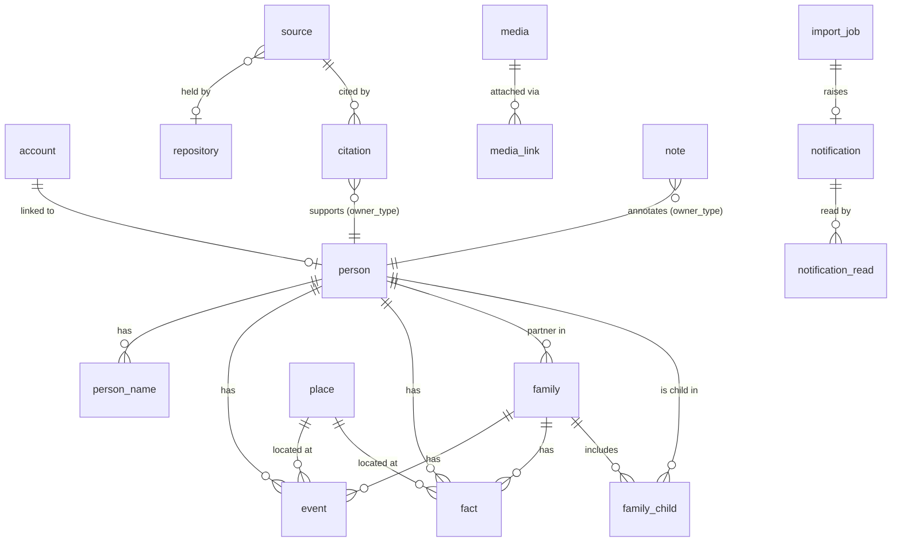

# Rootward — Build Spec (MVP)

Derived from `docs/WAYFINDER.md`. Every section cites the decision(s) it
implements. If this spec and WAYFINDER disagree, WAYFINDER wins — fix the spec.

This document is the build contract. It is detailed enough that each GitHub issue
is a mechanical slice of it. It is agent-facing: verbosity over brevity.

---

## 1. Product summary

A self-hostable, open-source family-tree website. The database is the source of
truth; GEDCOM is import/export only (decision 1). Approved family members browse
the whole tree; moderators edit; one admin per deployment configures it
(decisions 6, 18). Single-tenant — one deployment, one tree (decision 17).

Two primary screens:
- **Tree view** — an animated hourglass chart (`family-chart`) centered on one
  person, ancestors up, descendants down, click to re-center (decisions 23, 28).
- **Edit view** — a full-screen MacFamilyTree-style multi-panel form for one
  person (decisions 10, 21).

---

## 2. Tech stack

| Concern | Choice | Decision |
| --- | --- | --- |
| Frontend framework | Next.js (App Router) + TypeScript + Tailwind | **assumed — confirm (§11)**; React was in the original notes, Next.js is the natural Vercel pairing, but no numbered decision picks it |
| Hosting (frontend) | Vercel free tier | 32 |
| Backend | Supabase — Postgres, Auth, Storage, Realtime, Edge Functions | 8 |
| Server compute | Supabase Edge Functions (Deno) | 8 |
| Tree layout/render | `family-chart` (d3-based) | 23 |
| Auth methods | Magic link + Google OAuth, no passwords | 11 |
| Local dev | Docker Compose (Supabase local) + `pnpm dev` | 32 |
| Package manager | pnpm workspaces (monorepo) | — |
| CI | GitHub Actions | 32 |
| Fuzzy name match | Postgres `pg_trgm` extension | 24 |
| Scheduled jobs (post-MVP) | `pg_cron` | 29 |
| Geocoding (post-MVP) | Nominatim (OSM) | 30 |
| Map (post-MVP) | MapLibre GL JS + OSM tiles | 30 |

### Rules that carry into implementation

- The GEDCOM parser/serializer is a **portable module** (`packages/gedcom`), pure
  TypeScript, no Deno- or Node-specific APIs, so a C#/iDesign service could take
  it over later (decision 8). It is consumed by the Edge Functions and by tests.
- The importer is **chunked and resumable** — never one big transaction
  (decision 8).
- Access control is enforced by **Postgres row-level security (RLS)**, not
  frontend code (decision 6).
- Every editable row carries `updated_at`, used as an optimistic-concurrency
  token (decision 26).

---

## 3. Repository structure

```
/
├── apps/
│   └── web/                    # Next.js app (the only frontend)
│       ├── app/                # App Router routes
│       ├── components/
│       ├── lib/
│       │   ├── db/             # generated Supabase types + typed queries
│       │   └── supabase/       # client/server Supabase helpers
│       └── ...
├── packages/
│   ├── gedcom/                 # portable GEDCOM parser + serializer (pure TS)
│   └── shared/                 # shared types + genealogy-date parse/format
├── supabase/
│   ├── migrations/             # SQL migrations (the schema source of truth)
│   ├── functions/
│   │   ├── gedcom-import/
│   │   ├── gedcom-export/
│   │   ├── media-process/
│   │   └── onboarding-match/
│   ├── config.toml
│   └── seed.sql
├── docs/
│   ├── WAYFINDER.md            # decision map (canonical)
│   ├── SPEC.md                 # this file
│   └── reference/              # MacFamilyTree screenshots, original notes
├── .github/workflows/ci.yml
├── PROGRESS.md                 # resume pointer for a fresh agent
├── CLAUDE.md                   # how to work in this repo
├── README.md
├── LICENSE                     # MIT
└── package.json                # pnpm workspace root
```

---

## 4. Data model

Postgres. All tables live in `public` unless noted. UUID primary keys
(`gen_random_uuid()`), `created_at timestamptz not null default now()`,
`updated_at timestamptz not null default now()` on every editable table. A
trigger bumps `updated_at` on every `UPDATE` — this is the concurrency token
(decision 26).

`updated_at` is present and trigger-maintained on **all** of `person`,
`person_name`, `family`, `family_child`, `event`, `fact`, `place`, `source`,
`repository`, `citation`, `media`, `media_link`, `note`, `account`,
`tree_settings` — every row the edit view can send back. The per-table lists
below do not repeat it.

`raw_gedcom jsonb` on every record that maps to a GEDCOM structure — holds any
sub-tag the model does not represent explicitly, re-emitted on export
(decision 4).

### 4.1 Genealogy date (embedded column set) — decision 22

Not a table. This column set is embedded wherever a genealogy date appears
(`event`, `fact`, `citation`, `media`). Prefix the columns with the context when
more than one date exists on a row.

| Column | Type | Notes |
| --- | --- | --- |
| `date_value_raw` | text | Exact GEDCOM `DATE` payload. Always round-trips. |
| `date_kind` | enum `genealogy_date_kind` | `exact · about · estimated · calculated · before · after · between · from_to · interpreted · phrase · unknown` |
| `date_year1 / date_month1 / date_day1` | smallint | First date. Month, day nullable. |
| `date_year2 / date_month2 / date_day2` | smallint | Second date for `between` / `from_to`. Nullable. |
| `date_calendar` | enum `calendar` | `gregorian · julian · hebrew · french_republican · unknown`. Default `gregorian`. |
| `date_dual_year` | boolean | `1700/01` style dual dating. Display as written. |
| `date_phrase` | text | Free text for `phrase` / `interpreted`, or an unparsed value. |
| `date_sort_key` | date (generated, stored) | `make_date(coalesce(year1,1), coalesce(month1,1), coalesce(day1,1))` clamped to valid range; null when `year1` null. Timeline ordering, "age at event". |

Parsing/formatting lives in `packages/shared` (`parseGenealogyDate`,
`formatGenealogyDate`). Julian and Gregorian are fully parsed; Hebrew and French
Republican are stored raw with `date_phrase` set, no conversion.

### 4.2 Core genealogy tables

**`person`** — decisions 2, 4, 6, 21

| Column | Type | Notes |
| --- | --- | --- |
| `id` | uuid PK | |
| `gedcom_xref` | text | Original GEDCOM `@I…@`. Null for site-created people until first export assigns one. Unique when not null. |
| `given_name` | text | Primary `NAME` given part. |
| `surname` | text | Primary `NAME` surname. |
| `name_prefix` | text | e.g. "Dr.", "Rev." |
| `name_suffix` | text | e.g. "Jr.", "III" |
| `nickname` | text | Primary-name nickname (`NAME`/`NICK`). |
| `sex` | enum `sex` | `male · female · unknown · other` (GEDCOM `M/F/U/X`). |
| `is_living` | boolean | Explicit override. When null, computed: no death event AND (no birth year OR birth year within `tree_settings.living_threshold_years`). |
| `visibility` | enum `person_visibility` | `everyone_approved · close_family · moderators_only · hidden`. Default `everyone_approved`. MVP UI exposes only `everyone_approved` and `hidden` (decisions 7, 31). |
| `familysearch_id` | text | Reference Numbers panel. |
| `ancestral_file_number` | text | Reference Numbers panel. |
| `user_reference_number` | text | GEDCOM `REFN`. |
| `raw_gedcom` | jsonb | |
| `created_by / updated_by` | uuid → account | |

**`person_name`** — additional names only (primary is on `person`). Decision 21.

| Column | Type | Notes |
| --- | --- | --- |
| `id` | uuid PK | |
| `person_id` | uuid → person, on delete cascade | |
| `type` | enum `name_type` | `birth · married · maiden · also_known_as · nickname · religious · immigrant · other` |
| `given_name / surname / prefix / suffix / nickname` | text | |
| `sort_order` | smallint | |
| `raw_gedcom` | jsonb | |

**`family`** — decisions 2, 4

| Column | Type | Notes |
| --- | --- | --- |
| `id` | uuid PK | |
| `gedcom_xref` | text | Original `@F…@`. Unique when not null. |
| `partner1_id / partner2_id` | uuid → person, nullable, on delete set null | Positional. Either may be null (single-parent family). |
| `partner1_role / partner2_role` | enum `partner_role` | `husband · wife · partner · unknown`. Round-trips GEDCOM `HUSB`/`WIFE`; not used to gate anything (decision 2). |
| `relationship_type` | enum `union_type` | `married · partnership · civil_union · unknown` |
| `raw_gedcom` | jsonb | |

**`family_child`** — decision 2

| Column | Type | Notes |
| --- | --- | --- |
| `id` | uuid PK | |
| `family_id` | uuid → family, on delete cascade | |
| `person_id` | uuid → person, on delete cascade | |
| `relation_to_partner1 / relation_to_partner2` | enum `child_relation` | `biological · adopted · step · foster · guardian · sealed · unknown` (GEDCOM `PEDI` / `_FREL` / `_MREL`) |
| `sort_order` | smallint | Birth order. |
| `raw_gedcom` | jsonb | |
| unique | `(family_id, person_id)` | |

**`event`** — decisions 3, 22

| Column | Type | Notes |
| --- | --- | --- |
| `id` | uuid PK | |
| `owner_type` | enum `event_owner` | `person · family` |
| `person_id` | uuid → person, on delete cascade | Set iff `owner_type = person`. |
| `family_id` | uuid → family, on delete cascade | Set iff `owner_type = family`. CHECK enforces exactly one. |
| `type` | enum `event_type` | `birth · death · marriage · divorce · burial · cremation · christening · baptism · bar_mitzvah · bat_mitzvah · confirmation · first_communion · adoption · graduation · immigration · emigration · naturalization · census · residence · occupation · retirement · will · probate · engagement · marriage_banns · annulment · other` |
| `type_other` | text | Label when `type = other` (GEDCOM `EVEN`/`TYPE`). |
| `date_*` | (embedded date set 4.1) | |
| `place_id` | uuid → place, nullable, on delete set null | |
| `value` | text | Description / value (occupation title, cause of death, …). |
| `age_text` | text | GEDCOM `AGE`. |
| `sort_key` | timestamptz | **Plain column, trigger-populated** (not `generated` — Postgres forbids a generated column that reads another generated column, and this needs a per-type tie-break a scalar expression cannot express). A `BEFORE INSERT OR UPDATE` trigger sets it from `date_sort_key` plus a per-`type` ordinal (birth before christening before death …). |
| `raw_gedcom` | jsonb | |
| `created_by / updated_by` | uuid → account | |

**`fact`** — attributes. Decisions 3, 6, 21

| Column | Type | Notes |
| --- | --- | --- |
| `id` | uuid PK | |
| `owner_type` | enum `fact_owner` | `person · family` (mostly person). |
| `person_id / family_id` | uuid, nullable | CHECK exactly one. |
| `type` | enum `fact_type` | `eye_color · hair_color · height · weight · physical_description · ethnic_origin · skin_color · religion · nationality · occupation · education · caste · title_of_nobility · number_of_children · number_of_marriages · property · national_id · ssn · medical · other` |
| `type_other` | text | |
| `value` | text | |
| `date_*` | (embedded date set) | |
| `place_id` | uuid → place, nullable | |
| `visibility` | enum `fact_visibility` | `everyone_approved · close_family · moderators_only · hidden`. Default `everyone_approved`. |
| `is_sensitive` | boolean generated | `type in ('ssn','national_id','medical')` — always hidden from non-moderators regardless of `visibility` (decision 6). |
| `raw_gedcom` | jsonb | |
| `created_by / updated_by` | uuid | |

**`place`** — decisions 5, 30

| Column | Type | Notes |
| --- | --- | --- |
| `id` | uuid PK | |
| `name` | text not null | Full place string as entered. |
| `normalized_name` | text | Lowercased, trimmed, punctuation-collapsed. Used for dedupe and lookup. Unique. |
| `locality / county / state / country` | text | Optional parsed parts. |
| `latitude / longitude` | numeric(9,6) | Post-MVP (decision 30). |
| `geocode_source` | enum `geocode_source` | `nominatim · manual · none`. Post-MVP. |
| `geocoded_at` | timestamptz | Post-MVP. |
| `raw_gedcom` | jsonb | |

### 4.3 Sources — full GEDCOM model (decision 21)

**`repository`** — `id`, `gedcom_xref`, `name`, `address`, `phone`, `email`,
`website`, `raw_gedcom`.

**`source`** — `id`, `gedcom_xref` (unique when not null), `title`, `author`,
`publication_info`, `repository_id` (→ repository, nullable), `source_text`
(transcription), `raw_gedcom`.

**`citation`** — links a source to a record.

| Column | Type | Notes |
| --- | --- | --- |
| `id` | uuid PK | |
| `source_id` | uuid → source, on delete cascade | |
| `owner_type` | enum `citation_owner` | `person · event · fact · family · person_name` |
| `owner_id` | uuid | |
| `page` | text | GEDCOM `PAGE`. |
| `data_text` | text | Quoted data (`DATA`/`TEXT`). |
| `date_*` | (embedded date set) | Date as stated by this source. |
| `quality` | smallint | GEDCOM `QUAY` 0–3. Nullable. |
| `raw_gedcom` | jsonb | |

### 4.4 Media (decision 25)

**`media`**

| Column | Type | Notes |
| --- | --- | --- |
| `id` | uuid PK | |
| `gedcom_xref` | text | `@O…@`, unique when not null. |
| `original_filename` | text | Preserved for export. |
| `mime_type` | text | |
| `size_bytes` | bigint | |
| `storage_path_original` | text | Path in the private bucket. |
| `storage_path_thumb` | text | ~240px WebP. |
| `storage_path_display` | text | ~1200px WebP. |
| `title` | text | |
| `date_*` | (embedded date set) | "Date taken". |
| `exif` | jsonb | GPS stripped when `tree_settings.strip_exif_gps` (default true). |
| `raw_gedcom` | jsonb | |
| `uploaded_by` | uuid → account | |

**`media_link`**

| Column | Type | Notes |
| --- | --- | --- |
| `id` | uuid PK | |
| `media_id` | uuid → media, on delete cascade | |
| `owner_type` | enum `media_owner` | `person · event · fact · family · source · place` |
| `owner_id` | uuid | |
| `is_primary` | boolean | Person's main photo. Partial unique index: one primary per `(owner_type, owner_id)`. |
| `sort_order` | smallint | |
| `caption` | text | Link-specific caption. |

### 4.5 Notes (decision 21)

**`note`** — polymorphic.

| Column | Type | Notes |
| --- | --- | --- |
| `id` | uuid PK | |
| `gedcom_xref` | text | For shared `NOTE` records; null for inline notes. |
| `owner_type` | enum `note_owner` | `person · event · fact · family · family_child · source · citation · media` |
| `owner_id` | uuid | |
| `text` | text not null | |
| `sort_order` | smallint | |
| `raw_gedcom` | jsonb | |

### 4.6 Accounts, roles, settings

**`account`** — one row per `auth.users` row. Decisions 12, 14, 18.

| Column | Type | Notes |
| --- | --- | --- |
| `id` | uuid PK, = `auth.users.id`, on delete cascade | |
| `role` | enum `account_role` | `viewer · moderator · admin`. Default `viewer`. |
| `person_id` | uuid → person, nullable, unique | The linked node (decision 14: at most one). |
| `status` | enum `account_status` | `active · pending · suspended`. `pending` = signed in but not yet approved/linked. |
| `display_name` | text | From auth profile; shown in Presence and audit. |
| `created_at / updated_at` | timestamptz | |

**`tree_settings`** — singleton (CHECK `id = 1`). Decision 20.

| Column | Type | Default | Notes |
| --- | --- | --- | --- |
| `id` | smallint PK | `1` | Singleton guard. |
| `tree_name` | text | | |
| `tree_description` | text | | |
| `public_visibility` | boolean | `false` | Toggle exists (decision 20); its exposed-content semantics are an open question (§11). Default off. |
| `allow_self_signup` | boolean | `true` | Decision 12. |
| `living_threshold_years` | smallint | `100` | Decision 6. |
| `default_root_person_id` | uuid → person | | Start person (decision 21). |
| `default_generations_up` | smallint | `2` | Decisions 9, 28. |
| `default_generations_down` | smallint | `2` | |
| `media_max_bytes` | bigint | `10485760` | Decision 25. |
| `media_allowed_mime` | text[] | `{image/jpeg,image/png,image/webp,image/gif,image/heic,application/pdf}` | Decision 25. |
| `strip_exif_gps` | boolean | `true` | Decision 25. |
| `backup_enabled` | boolean | `false` | Post-MVP (decision 29). |
| `backup_frequency` | enum `backup_frequency` | `daily` | Post-MVP. |
| `backup_retention` | smallint | `14` | Post-MVP. Lower than a GEDCOM-only job because archives include media. |
| `updated_by` | uuid | | |

**`audit_log`** — decision 21. Written only by a `SECURITY DEFINER` trigger on
the genealogy + account tables.

| Column | Type | Notes |
| --- | --- | --- |
| `id` | bigint identity PK | |
| `table_name` | text | |
| `row_id` | uuid | |
| `action` | enum `audit_action` | `insert · update · delete` |
| `actor_id` | uuid → account, nullable | From `auth.uid()`. |
| `changed_at` | timestamptz default now() | |
| `old_data / new_data` | jsonb | |

### 4.7 Onboarding and moderation

**`invitation`** — decision 12

| Column | Type | Notes |
| --- | --- | --- |
| `id` | uuid PK | |
| `email` | text not null | |
| `person_id` | uuid → person, on delete cascade | Node to link on accept. |
| `role` | enum `account_role` | Default `viewer`. Only an admin may set `moderator`/`admin`. |
| `invited_by` | uuid → account | |
| `status` | enum `invitation_status` | `pending · accepted · expired` |
| `accepted_by` | uuid → account, nullable | |
| `accepted_at` | timestamptz | |

**`access_request`** — decision 13

| Column | Type | Notes |
| --- | --- | --- |
| `id` | uuid PK | |
| `account_id` | uuid → account | |
| `submitted_name` | text | |
| `submitted_birth_month / submitted_birth_year` | smallint | |
| `message` | text | |
| `status` | enum `request_status` | `pending · approved · rejected` |
| `resolved_by` | uuid, nullable | |
| `resolved_at` | timestamptz | |

**`claim_attempt`** — decision 24 rate limiting

| Column | Type | Notes |
| --- | --- | --- |
| `id` | uuid PK | |
| `account_id` | uuid → account | |
| `attempted_at` | timestamptz default now() | |
| `succeeded` | boolean | |

Cap: 5 attempts / account / rolling 24h. Enforced in `onboarding-match`.

**`notification`** — decisions 16, 27. Audience is always moderators + admins.

| Column | Type | Notes |
| --- | --- | --- |
| `id` | uuid PK | |
| `type` | enum `notification_type` | `self_claim_linked · access_requested · claim_attempt_cap · import_finished · import_failed · hide_request` |
| `payload` | jsonb | Type-specific: `person_id`, `account_id`, `import_job_id`, free-text `message`. |
| `created_at` | timestamptz default now() | |
| `resolved_at` | timestamptz, nullable | |
| `resolved_by` | uuid → account, nullable | |

**`notification_read`** — decision 27 per-user read state

`notification_id` + `account_id` (PK), `read_at timestamptz default now()`.

### 4.8 Jobs

**`import_job`** — decision 8

| Column | Type | Notes |
| --- | --- | --- |
| `id` | uuid PK | |
| `filename` | text | |
| `storage_path` | text | Uploaded GEDCOM in a private bucket. |
| `mode` | enum `import_mode` | `initial · replace_all · match_update` (decision 33). |
| `status` | enum `import_status` | `uploaded · parsing · importing · completed · failed · cancelled` |
| `total_records / processed_records` | int | Progress. |
| `cursor` | jsonb | Resume point — which record/line to continue from (decision 8). |
| `stats` | jsonb | `{added, updated, skipped, removed}`. |
| `error_text` | text | |
| `started_by` | uuid → account | |
| `completed_at` | timestamptz | |

**`export_job`** — decision 29 (table exists in MVP; scheduled path is post-MVP)

`id`, `type` enum `export_type` (`manual_gedcom · manual_full · scheduled_full`),
`status`, `storage_path`, `size_bytes`, `error_text`, `started_by` (nullable for
scheduled), `created_at`, `completed_at`.

### 4.9 ER overview



(Polymorphic links — `citation.owner_*`, `media_link.owner_*`, `note.owner_*` —
are shown against `person` only for readability; each also targets `event`,
`fact`, `family`, etc. `import_job` → `notification` is not an FK either — the
link is `notification.payload->>'import_job_id'`.)

---

## 5. Access control (RLS) — decision 6

RLS enabled on **every** table. Helper functions (all `stable`,
`security definer`, `search_path = ''`):

- `auth_account()` → the caller's `account` row (or null).
- `is_approved()` → account exists and `status = 'active'`.
- `is_moderator()` → role in (`moderator`, `admin`).
- `is_admin()` → role = `admin`.
- `person_is_living(person_id)` → boolean. No death event AND (no birth year OR
  birth year within `tree_settings.living_threshold_years`), unless
  `person.is_living` is set explicitly. Load-bearing — the whole access model and
  every §5 policy test depends on it.
- `person_is_visible(person_id)` → boolean, per the ladder below.
- `family_is_visible(family_id)` → at least one partner visible, or a visible
  child.
- `close_family_of(viewer_person_id)` → set of person ids (post-MVP; parents,
  children, siblings, grandparents, grandchildren, spouses).

### Visibility ladder for `person`

A person row is visible when the caller `is_approved()` **and** one of:
- `visibility = 'everyone_approved'`, or
- `is_moderator()`, or
- `visibility = 'close_family'` and viewer's linked person is in
  `close_family_of` that person (post-MVP), or
- viewer's linked person **is** that person.

Public (unauthenticated) visitors: `tree_settings.public_visibility` defaults
`false` — nothing is visible without an approved account. What the toggle exposes
when `true` is an **open question** (§11) — WAYFINDER decision 6 is
approved-members-only and decision 20 lists the toggle with no semantics. Assume
`false` / no public access for the MVP build unless that question is resolved.

### Dependent tables

- `person_name`, `family_child` — visible when the owning person is visible.
- `event`, `fact` — `owner_type` is `person` **or** `family` (§4.2, §4.3). Rule:
  visible when `owner_type = 'person'` and that person is visible, **or**
  `owner_type = 'family'` and `family_is_visible(family_id)`. A family-owned
  marriage or divorce event must not fall through to a deny (its `person_id` is
  null) or to a permissive leak.
- `citation`, `note`, `media_link` — polymorphic `owner_type`. Visible when the
  target is visible, chained through `owner_type`: a `person` target uses
  `person_is_visible`, a `family` target uses `family_is_visible`, an
  `event` / `fact` target inherits that row's own visibility, a `source` /
  `place` target is visible to any approved member.
- `family` — `family_is_visible(family_id)`.
- `source`, `repository`, `place` — visible to any approved member (they carry no
  personal data on their own).

### Field/row hiding for living people

- Living-person **basics** (name, sex, relationships, life events) stay visible
  to approved members — no masking (decision 6).
- **Sensitive facts** (`fact.is_sensitive` or `fact.visibility <>
  'everyone_approved'`) are hidden from non-moderators via the `fact` SELECT
  policy.

### Writes

- INSERT / UPDATE / DELETE on all genealogy tables: `is_moderator()`.
- DELETE on `person`, and `import_job` with `mode <> 'initial'`, and
  `tree_settings` UPDATE: `is_admin()` (decision 18).
- `access_request` and `notification` rows of type `hide_request` /
  `access_requested` originate from a non-moderator viewer. They are written
  through a `SECURITY DEFINER` RPC (like `onboarding-match`), not a direct
  client INSERT, so the moderator-only write policy stays intact.
- `account`: caller reads own row; `is_moderator()` reads all; only `is_admin()`
  updates `role`; nobody updates `id`.
- `notification`: `is_moderator()` reads and resolves. `notification_read`:
  caller's own rows only.
- `access_request`: caller inserts/reads own; `is_moderator()` reads/updates all.
- `audit_log`: `is_admin()` reads. No client writes (trigger only).

### Tests

Every policy has a pgTAP or SQL test asserting both the allow and the deny path,
run in CI. This is the guard that stops a policy regression from shipping.

---

## 6. GEDCOM mapping (`packages/gedcom`)

Supports reading GEDCOM 5.5.1 and 7.0; writes 5.5.1 (widest MacFamilyTree
compatibility) with a 7.0 option.

| GEDCOM | Rootward |
| --- | --- |
| `INDI` | `person` (+ `person_name`, `event`, `fact`, `note`, `media_link`, `citation`) |
| `INDI.NAME` (first) | `person.given_name` / `surname` / `NPFX` / `NSFX` / `NICK` |
| `INDI.NAME` (subsequent) or `TYPE`-tagged | `person_name` |
| `INDI.SEX` | `person.sex` |
| `FAM` | `family` (+ `family_child`, family `event`s) |
| `FAM.HUSB / WIFE` | `family.partner1_id` / `partner2_id` + role |
| `FAM.CHIL` | `family_child` |
| `FAM.CHIL.PEDI`, `_FREL`, `_MREL` | `family_child.relation_to_partner*` |
| `BIRT/DEAT/MARR/DIV/BURI/...` | `event` (typed) |
| `EVEN` + `TYPE` | `event` with `type = other`, `type_other` |
| `DSCR/OCCU/RELI/NATI/SSN/...` | `fact` (typed) |
| `DATE` (any form) | embedded date set (§4.1) |
| `PLAC` | `place` (deduped on `normalized_name`) |
| `SOUR` (record) | `source`; `REPO` → `repository` |
| `SOUR` (pointer, inline) | `citation` |
| `OBJE` | `media` + `media_link` |
| `NOTE` | `note` |
| `REFN / _UID / RIN / _FSFTID` | `person.user_reference_number` / provenance / `familysearch_id` |
| any unmapped sub-tag | parent record's `raw_gedcom` |

**Provenance:** import writes an `import_job` row; every created record keeps its
`gedcom_xref`. Re-export uses the stored xref so a round trip is stable
(decision 4).

**Media on import:** GEDCOM references media by file path. The importer records
the reference; the actual files are uploaded separately (import UI prompts for a
media folder / zip, or media is added later).

---

## 7. Edge Functions

### `gedcom-import` — decisions 8, 33

- Trigger: called by the import UI after the file is uploaded to storage.
- Reads `import_job`, streams the GEDCOM, processes in batches of N records,
  writes `processed_records` and `cursor` after each batch so a timeout resumes
  cleanly on the next invocation (self-reinvoke or client re-poll).
- `mode`:
  - `initial` — empty tree, straight insert.
  - `replace_all` — admin only; refuses if any `account.person_id` is set or
    edits exist since last import; truncates and reloads.
  - `match_update` — matches by `gedcom_xref` / `_UID`; produces a diff into
    `stats`; applies only after admin approval (two-phase: `parsing` produces the
    diff, admin approves, `importing` applies). Post-MVP for the approval UI;
    engine can land earlier.
- On finish: `status = completed|failed`, emit `notification`
  (`import_finished` / `import_failed`).

### `gedcom-export` — decisions 1, 29

- `manual_gedcom` — build a 5.5.1 file from the DB, write to a private bucket,
  return a signed URL.
- `manual_full` — GEDCOM + all media as a zip.
- `scheduled_full` — post-MVP, `pg_cron` target, writes to the backup bucket,
  prunes to `backup_retention`.

### `media-process` — decision 25

- Input: an uploaded original in the private bucket + owner ref.
- Validates MIME against `tree_settings.media_allowed_mime` and size against
  `media_max_bytes`.
- Generates `thumb` (~240px) and `display` (~1200px) WebP. Converts HEIC → WebP.
- Strips EXIF GPS when `strip_exif_gps`; keeps "date taken" → `media.date_*`.
- Writes the `media` row + `media_link`.

### `onboarding-match` — decision 24

- `security definer` (runs before the caller is an approved member, so it
  bypasses RLS deliberately and returns only the non-identifying challenge
  metadata described below — decision 24).
- Input: given name, surname, birth month, birth year.
- `pg_trgm` similarity search over `person` + `person_name`; birth year exact,
  month ±1.
- Returns, per candidate, only which **challenge facts** are answerable (parent
  first name, spouse first name, birth place, birth day) — never identifying
  data.
- Second call: challenge answers. On match → set `account.person_id`,
  `account.status = 'active'`; insert `claim_attempt(succeeded=true)`; emit
  `notification` (`self_claim_linked`).
- Over the 24h cap → `access_request` + `notification` (`claim_attempt_cap`).

---

## 8. Frontend

### 8.1 Routes (`apps/web/app`)

| Route | Purpose | Access |
| --- | --- | --- |
| `/` | Landing; redirect to `/tree/<root>` when approved, or to `/login` | public |
| `/login` | Magic link + Google | public |
| `/onboarding` | Claim flow (name/birth → challenge) or request access | authed, not yet approved |
| `/tree/[personId]` | `family-chart` hourglass view | approved |
| `/person/[personId]` | Read-only profile | approved |
| `/person/[personId]/edit` | Full-screen edit view | moderator+ |
| `/moderation` | Notification queue, access requests, claims | moderator+ |
| `/import` | Upload GEDCOM, job status | moderator+ |
| `/settings` | Tree settings + role management | admin |

### 8.2 Tree view — decisions 23, 28

- `family-chart` v2 with **custom HTML cards**. Card shows photo (or gender-tint
  silhouette), name, birth–death years; ring on the focus person; blue/orange
  gender tint per screenshot 2.
- **Generation bands:** an overlay layer behind the chart, one band per depth
  index relative to focus. Label = relative name (`Root Generation`,
  `Generation 1` up, `Generation −1` down) + birth-year range of that band's
  people.
- **Data:** `getNeighborhood(personId, up, down)` — one query returning the
  focus, ancestors to `up`, descendants to `down`, focus's siblings, focus's
  partners (decision 28). `up`/`down` from `tree_settings` defaults, overridable
  in-session.
- **Click** a card → `router.push('/tree/<id>')`; `family-chart` animates the
  re-center. Focus person in the URL (decision 28) — back button works.
- **Expand affordance** on any card with relatives outside the current window →
  loads one more level for that branch without re-centering.
- Extended family (aunts/uncles/cousins) — a later toggle, not in v1.

### 8.3 Edit view — decisions 10, 21, 26

Full-screen. Left rail: section nav. Top: parents (click to navigate). Bottom:
partners + children (click to navigate). "Done" returns to the profile.

Sections (v1): **Name & Gender · Additional Names · Events · Facts · Media ·
Sources · Notes · Reference Numbers**. (v2: Labels, Bookmarks, Influential
Persons, DNA, Stories, ToDos, Numbering System — decision 21.)

- **`DateInput`** component (decision 22): one text field, live parse via
  `parseGenealogyDate`, interpretation shown below, shorthand hint (`abt`, `bet …
  and …`, `bef`, `aft`, `est`, `from … to …`). Unparsed → saved as `phrase`,
  flagged.
- **Save:** each section sends only changed rows with the `updated_at` each was
  loaded at. Server: `UPDATE … WHERE id = $1 AND updated_at = $2`. Zero rows →
  conflict for that row.
- **`ConflictDialog`** (decision 26): per rejected row, shows their value vs
  yours, "keep mine" (re-save) / "take theirs" (discard mine).
- **Presence** (decision 26): on mount, join Realtime channel `person:{id}`,
  track `{ user, section }`. A banner shows other editors and their section.

### 8.4 Data layer

- `apps/web/lib/db` — types from `supabase gen types typescript`, plus typed
  query functions. No component talks to Supabase directly.
- View and edit share this layer, not components (decision 10).

### 8.5 Realtime

- **Presence:** `person:{id}` channel, edit view only.
- **Notifications:** `notifications` channel; moderators subscribe app-wide; the
  bell shows unread count from `notification` minus `notification_read`
  (decision 27). Resolve writes `resolved_*`; auto-resolve happens server-side
  when the triggering action completes.

---

## 9. Auth & onboarding flows

### 9.1 Sign-in (decision 11)

Supabase Auth, magic link + Google. A Postgres trigger on `auth.users` insert
creates an `account` row (`role = viewer`, `status = pending`). If the signing-in
email matches `ADMIN_EMAIL` (env), the trigger sets `role = admin`,
`status = active` (decision 19).

### 9.2 Invite path (decision 12)

Moderator opens a person → "Invite to claim" → enters email → row in
`invitation` + Supabase Auth invite sent. On acceptance, a handler links
`account.person_id = invitation.person_id`, `status = active`, `role =
invitation.role`.

### 9.3 Self-claim path (decisions 12, 13, 24)

`/onboarding` → name + birth month/year → `onboarding-match` → challenge
question(s) → on success, account linked + active + moderator notification. No
match → `access_request` + notification; user sees "request sent". Self-signup
hidden entirely when `allow_self_signup = false`.

### 9.4 Roles (decision 18)

`viewer` reads (per §5). `moderator` edits, invites, handles claims, runs
imports/exports, sees notifications. `admin` = moderator + role management +
settings + destructive actions.

---

## 10. Build phases → GitHub issues

Each item is one issue. Milestones = phases. Labels: `phase:N`, `area:db|gedcom|
frontend|auth|edge|infra`, `mvp`, `post-mvp`, `blocked`, `ready`.

### Phase 0 — Foundation
1. Scaffold pnpm monorepo: `apps/web` (Next.js + TS + Tailwind + ESLint +
   Prettier), `packages/gedcom`, `packages/shared`, root scripts
   (`typecheck/lint/format/build/test`).
2. `supabase init`, `config.toml`, Docker Compose local dev, `pnpm dev` +
   `pnpm dev:status`, `.env.example`.
3. GitHub Actions CI: typecheck, lint, format check, test, migration check.

### Phase 1 — Data model
4. Migration: enums + `person`, `person_name`, `family`, `family_child`.
5. Migration: `event`, `fact`, `place` + embedded date columns + generated
   `date_sort_key` + trigger-populated `event.sort_key` (per §4.2).
6. Migration: `source`, `repository`, `citation`, `media`, `media_link`, `note`.
7. Migration: `account`, `tree_settings` (singleton), `audit_log` + `updated_at`
   trigger + audit trigger.
8. Migration: `invitation`, `access_request`, `claim_attempt`, `notification`,
   `notification_read`, `import_job`, `export_job`.
9. RLS: helper functions + policies for every table + allow/deny tests in CI.
10. `supabase gen types` wiring + `lib/db` typed query layer +
    `getNeighborhood`.

### Phase 2 — GEDCOM
11. `packages/shared`: `parseGenealogyDate` / `formatGenealogyDate` (Gregorian +
    Julian, dual dates) + tests.
12. `packages/gedcom`: reader (5.5.1 + 7.0) + fixtures + tests.
13. `packages/gedcom`: writer (5.5.1) + round-trip tests.
14. `gedcom-import` edge function — `initial` mode, chunked + resumable, job
    tracking, finish notification.
15. `gedcom-export` edge function — `manual_gedcom`.
16. `/import` UI — upload, job progress, result.

### Phase 3 — Auth & onboarding
17. Supabase Auth: magic link + Google, `/login`, session middleware, `account`
    creation trigger + `ADMIN_EMAIL` bootstrap.
18. `onboarding-match` edge function — `pg_trgm` search, challenge, rate limit,
    link + notify.
19. `/onboarding` UI — claim flow + request-access.
20. Invite flow — "Invite to claim" action + acceptance handler + `/moderation`
    stub.

### Phase 4 — Tree view
21. `family-chart` integration + custom `PersonCard` + gender tint + focus ring.
22. Generation bands overlay + relative labels + year ranges.
23. `getNeighborhood` wiring + re-center + `/tree/[personId]` deep links.
24. Expand-in-place for collapsed branches.
25. `/person/[personId]` read-only profile.

### Phase 5 — Edit view
26. Edit shell: full-screen layout, section nav, parents/partners/children strip,
    "Done".
27. Sections: Name & Gender, Additional Names, Reference Numbers.
28. `DateInput` component + Events section.
29. Facts section.
30. Sources section (source / citation / repository).
31. Notes section + row-level version check + `ConflictDialog`.
32. Presence indicators on the edit view.

### Phase 6 — Media
33. `media-process` edge function (validate, thumb/display, HEIC, EXIF).
34. Media upload + gallery + primary photo + `/media` viewer + Media section.

### Phase 7 — Moderation & settings
35. Notification center + bell + Realtime + auto-resolve triggers.
36. Moderation queue: access requests, self-claims, reassign / unlink.
37. `/settings` — tree settings + role management.

### Phase 8 — Ship
38. Seed data + a demo GEDCOM + `supabase/seed.sql`.
39. Deploy docs: Vercel + Supabase Cloud, and Docker Compose self-host.
40. README, CONTRIBUTING, self-host guide, screenshots.

### Post-MVP (separate milestone)
- Scheduled backup (`scheduled_full` + `pg_cron` + retention) — decision 29.
- Map view (`geocode-place`, MapLibre, `/map`) — decision 30.
- Per-person privacy UI + `close_family_of` + `close_family` policy — decision 31.
- Re-import `match_update` approval UI — decision 33.
- Extended-family toggle in the tree view — decision 28.
- Edit-view v2 sections: Labels, Bookmarks, Influential Persons, DNA, Stories,
  ToDos, Numbering System — decision 21.

---

## 11. Open questions

### Needs Josh (blocks the issue that hits it, not the whole build)

- **Frontend framework.** Next.js + TypeScript + Tailwind is assumed. Alternatives:
  React + Vite (lighter, no server framework), Remix, TanStack Start. Blocks
  issue 1. If Next.js is confirmed, add a WAYFINDER decision so the spec stops
  lying about decision 32.
- **`public_visibility` semantics.** Decision 20 gives a settings toggle;
  decision 6 is approved-members-only. Decide what `true` exposes (nothing / a
  deceased-only public tree / names-only) or confirm the toggle is deferred.
  Blocks the public-visitor branch of the §5 RLS work (issue 9).

### Decide in-issue (not blocking)

- Composite Postgres type for the date set vs flat columns — spec assumes flat
  columns for ORM/tooling friendliness; revisit if it gets noisy.
- `family-chart` pedigree-collapse behavior (repeated ancestor) — confirm in
  issue 21; if it mis-renders, the fix is a de-duplication pass before handing
  data to the library.
- Whether `match_update` diff engine lands in Phase 2 or waits for its Post-MVP
  approval UI — spec allows either.
- Exact `pg_trgm` similarity threshold for name matching — tune against the
  seeded demo tree in issue 18.
- Local verify gate runs `build`; CI adds a migration check. Intentional split —
  fold together if it causes confusion.
